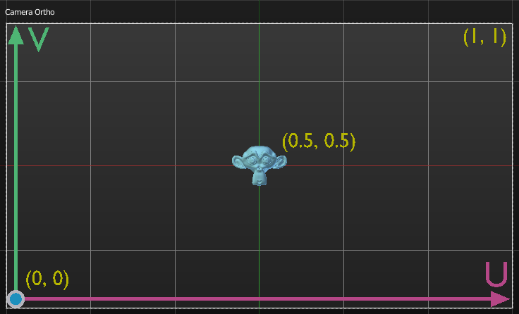

Geometry
********

Point in Camera Frustrum
========================

This node returns four output: Image U, Image V, Z Depth and a Visible boolean. For **Image U and V**, it represents the point position in a UV coordinate based on the active camera view, while **Z Depth** is the depth of field value. Floats can be negative. When the point locates within the view of the active camera, **Visible** boolean returns *True*, otherwise *False*.

.. image:: images/point_in_camera_frustrum_example.gif

Note: the Camera input must be a Camera object.

Triangulate Polygons
====================

Triangulate Polygons has been removed because it is nearly never used however it may be rewritten in a better form in the future.

Intersect Polyline Plane
========================

Intersect Polyline Plane was removed because it is nearly never used.
