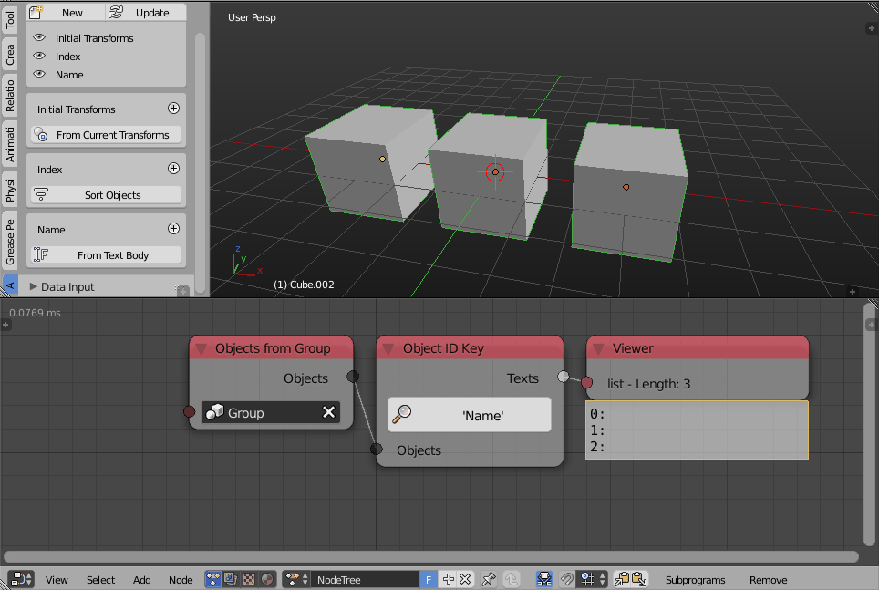
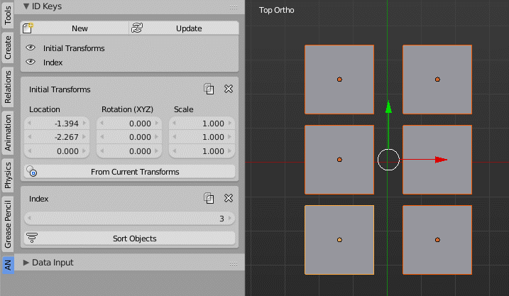
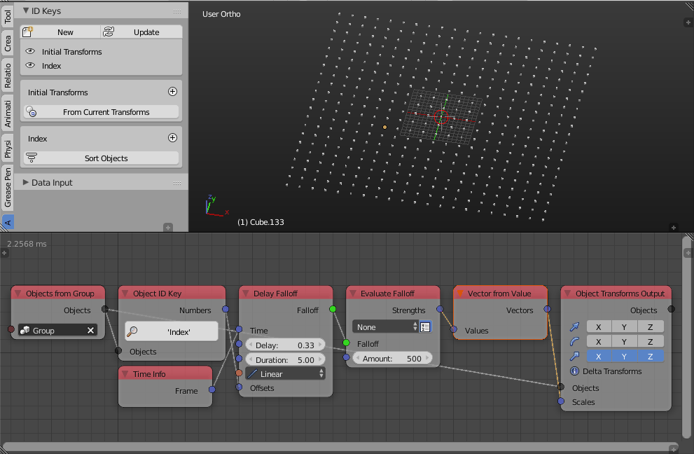
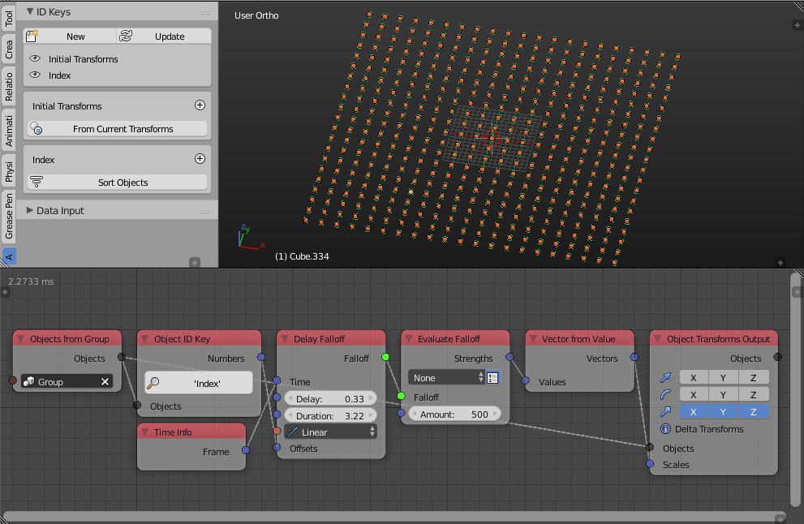

ID Keys
*******

Text, Float and Integer IDs
---------------------------

An ID key can be created to hold a text, float or integer per object, think of it as a custom property of the object.

Index IDs
---------

Besides **Initial Transforms**, a new default ID Key called **Index** was added to ID Keys panel. A new **Copy** menu was added, which allows either copying initial transforms from active object to selected objects, or coyping/assigning back to the selected object(s). For **Index ID**, it also allows assigning as object pass index value.

The index ID associate an integer to every object, that integer is usually its index in some list of objects. That list of objects can be sorted using different methods.

Below is an example of animating some objects based on their indices list which we will generate using the Index ID keys, methods:

Selection Order Method
^^^^^^^^^^^^^^^^^^^^^^

Random Method
^^^^^^^^^^^^^

Distance Method
^^^^^^^^^^^^^^^

.. image:: images/point_distance_id.gif

Axis Method
^^^^^^^^^^^

.. image:: images/axis_sort_id.gif

Other options includes alphabetical sorting of object.
