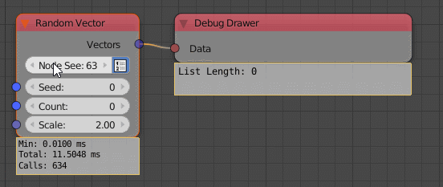
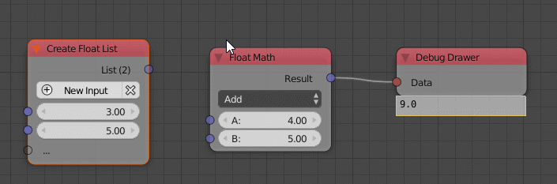
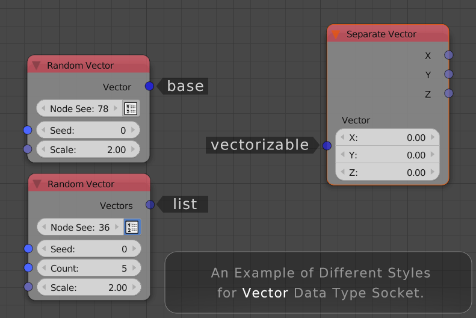
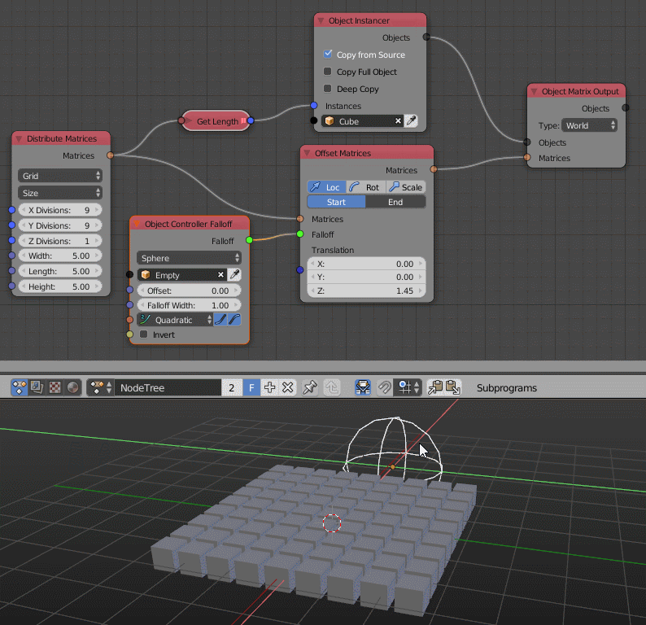

Release Notes for Version 2.0
*****************************

Key Features
============

Cython
------

Many parts of Animation Nodes has been rewritten using the Cython programming language. It's a language that mixes Python and C and is perfectly suited to develop addons with high performance for Blender. There is one disadvantage though, we now have different versions of Animation Nodes for different platforms. So you have to download the correct version for your platform.

Subsequently, generating vectors is now 400x faster compared to non cythonized versions. Maths is also 200x faster.

Vectorization
-------------

Lists are an essential part of Animation Nodes. In previous versions the only way to use lists effectively was to use loops. These have an advantages as they give you a lot of flexibility. However, in many cases the flexibility of loops are not needed. This release includes an alternative approach to edit lists: Vectorized Nodes. A vectorized node is a node that can work on individual values as well as on lists. Together with Cython, this leads to big speedup for some operations.

Currently, vectorized nodes can be visually distinguished: When no links connected, all sockets, including input(s) and output(s), are temporarily displayed in a color with transparency of 0.8 (while for any ``list`` data type, the socket transparency is 0.5; and for any ``base`` data type, the color is solid). Transparency will be shifted to 0.5 when connecting with valid ``list`` data.

Not all nodes which could have this functionality have it yet. Fortunately, vectorizing a node does not break it, so some nodes can be vectorized after the first release of AN 2.0.

Falloffs
--------

While the first two key features were mainly targeted at all users of Animation Nodes, falloffs have been designed specifically for motion graphics designers. In general, a falloff is a function that tells an effect how much it should influence a specific object. You can think of it like a mask for an effect (similar on how we can use weight painting to control the influence of some modifiers).

Compatibility
=============

Similar to the last releases, this release will break most existing files in a way so that they don't work anymore in this release. This is necessary to not slow down future development (keeping old stuff working always means that some new features would not be possible). There might be some files that still work in this release but you should not expect that.

Updating files to work in this version is easy in some cases but very difficult in others. In general I suggest to either use the old version for old files or rebuild the node trees from scratch.

It is also possible to change existing files in a way that they automatically load the correct version of AN when loaded. This might also be useful when you want to render animations that use AN on a renderfarm, basically you can put the .blend file and the addon into a .zip file and upload it to the renderfarm (Note: this is only possible when the renderfarm allows you to execute python scripts, sometimes you first have to ask for permission). For more information contact me (mail@jlucke.com).

Documentation
=============

Every node is documented in this manual now. We now start to improve the documentation of individual nodes step by step. Every help is welcome, mainly to make it more useful for artists.

Changes in Detail
=================

.. toctree::
   :titlesonly:

   Misc <misc>
   List <list>
   Mesh <mesh>
   Text <text>
   Sound <sound>
   Vector <vector>
   Viewer <viewer>
   Number <number>
   Matrix <matrix>
   Object <object>
   Spline <spline>
   Boolean <boolean>
   Falloff <falloff>
   ID Keys <id_keys>
   Rotation <rotation>
   Geometry <geometry>
   Interpolation <interpolation>
   KD & BVH Tree <kd_bvh_tree>
   Particle System <particle_system>

Support
=======

There are a many ways to support the development of Animation Nodes.

- Create video/text/... **tutorials**. Feel free to contact me so that we can make your tutorials better together.
- Help with the official **documentation**. For example you can provide better descriptions for existing nodes or create images/gifs that show use cases for some nodes. Just send your results to me, I can insert it into the manual if you don't want to do all the git-stuff.
- Help me **financially**. This will become more and more important for me personally as I have to pay my bills and AN development takes a lot of time. Also this allows me to pay for the Blender Conference and other Blender related things. Below you will find two ways to donate.
- **Share, share, share**. Every day I search for new things people created with Animation Nodes. Everything I find motivates me to work on AN even more. Also it might attract new people to start using Animation Nodes.
- Get involved in the **development**. If you already have some programming experience with python I'd love to help you get started in developing new nodes and other features for Animation Nodes.

Donation Links
--------------

- One time donation via Paypal: https://www.paypal.me/jacqueslucke
- Small recurring donation via Patreon (preferred): https://www.patreon.com/jacqueslucke
