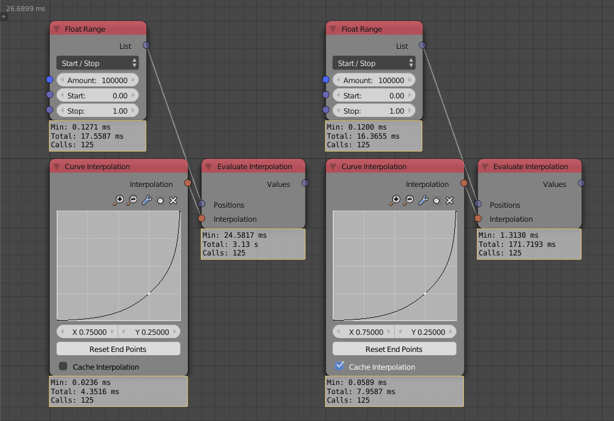
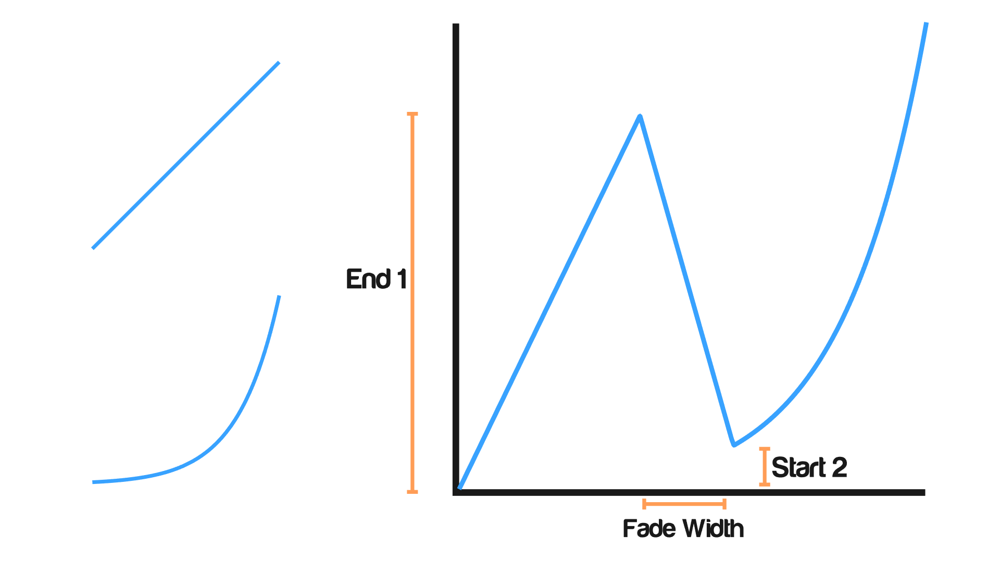
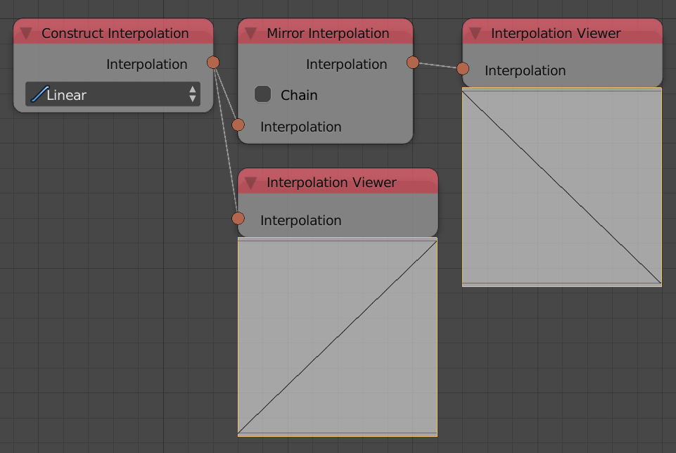

Interpolation
*************

Curve Interpolation
====================

The Interpolation From Curve Mapping node was renamed to Curve Interpolation. The node now support caching of interpolation for tremendously faster if it has to be evaluated very often. Below is a curve interpolation with and without cache option.

Mix Interpolation
=================

This newly added node mixes between two interpolation using one of two algorithms. **Overlay** which simply overlay both interpolation where zero means the first interpolation and 1 means the second. **Chain** which stack input interpolations beside each others.

Mirror Interpolation
====================

This newly added node inverts the interpolation and possibly combine it with the original if chain was checked.

