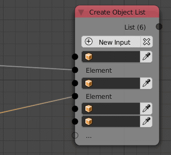
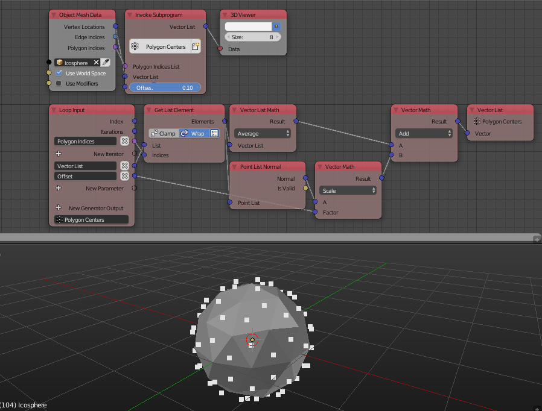
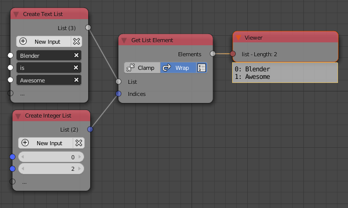
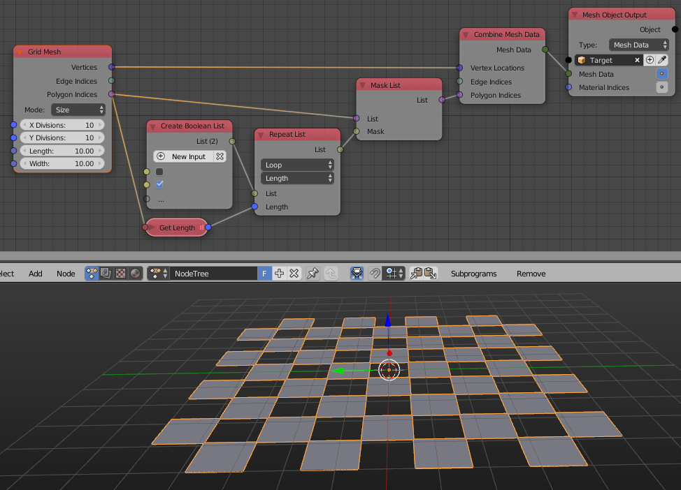

Lists
*****

Create List
===========

**Remove Inputs** in advanced node settings became **Remove Unlinked Inputs** which removed inputs if they weren't connected to any other node.

Get List Element
================

The advanced node settings were moved to the node itself for easier and faster access. The node can now get multiple elements if given a list of integers that represent their indices. To do this check Use Index List button. Note that Edge Indices and Polygon Indices can be converted to an Integer List implicitly like in the example below.

Mask List
=========

This new node selectively removes list elements based on a boolean list.

.. image:: images/mask_list.gif

Sort List
=========

Name, Post Distance and Direction options were removed because they can be achieved using other options.

Random List
===========

This node was newly added. It simply returns a list that contains some random elements from the input list. Unlike the multiple option in the Get Random Element node, elements can be repeated and thus the length of the output node can be larger than the input list.

.. image:: images/random_list.png
