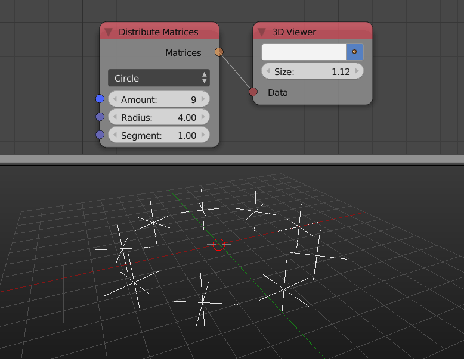
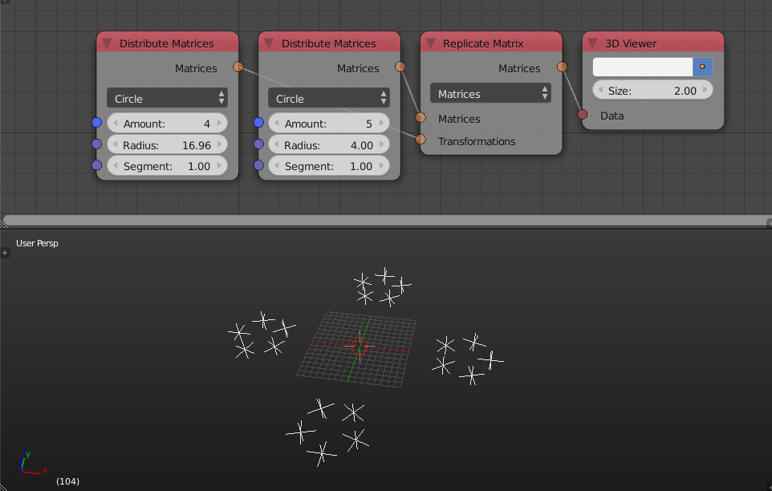

Matrices
********

Distribute Matrices
===================

This node was newly added and it generate a list of transformation matrices distributed on a line, grid, circle or mesh vertices.

Replicate Matrix
================

This newly added node instances and transforms input transformation matrices based on some other input transformation matrices (or vectors).

Transform Matrix
================

This node transforms a matrix (or matrix list) by another matrix input.

.. image:: images/transform_matrix.gif

Offset Matrices
===============

This newly added node makes use of falloffs with matrices. It transforms all input matrices in a certain way. The falloff controls how much each matrix is influenced. There are also a couple of advanced settings which control the transformation behavior.

.. image:: images/falloff_example.gif

Change Matrix Pivot
===================

Change Matrix Pivot node was removed.
