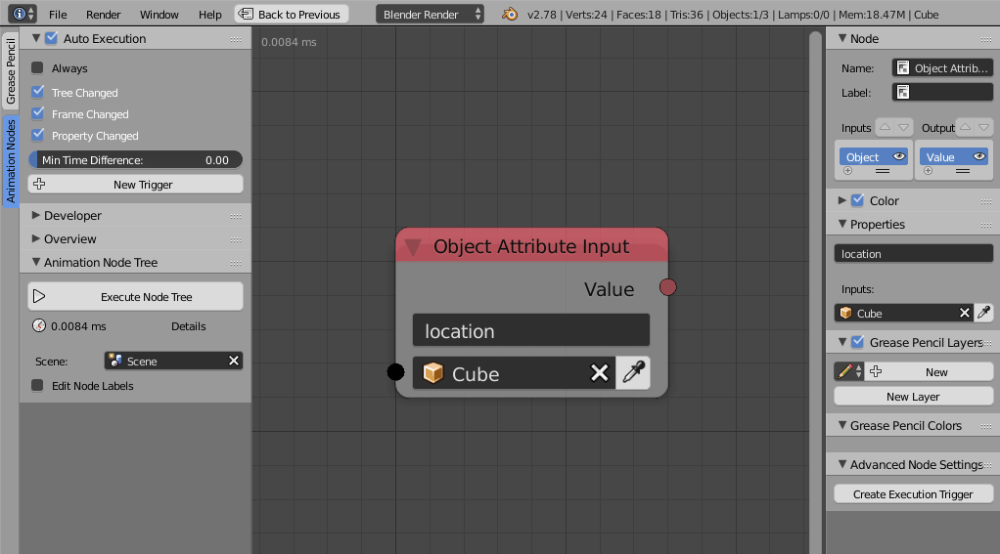
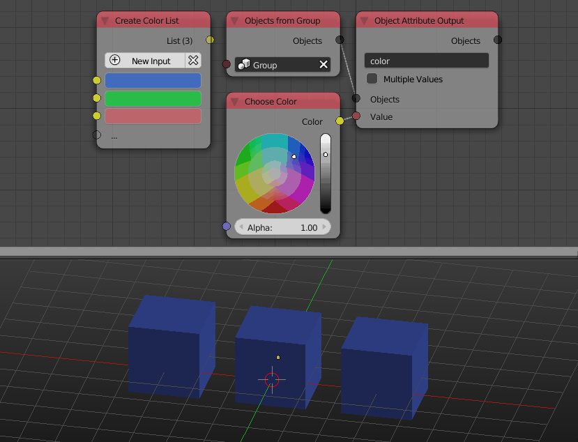
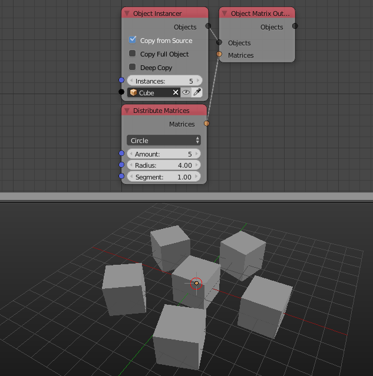

Objects
*******

Object Transforms Output
========================

Object Transforms Output has a new UI for enabling transformation channels. The node now support editing the delta transforms of object, delta transforms are transforms that are added on top of the current transforms, so, now you can define objects relative transforms without any ID keys. Enabled delta transforms from the advanced node settings.
The node is also vectroized, so you may edit delta transforms for multiple objects.

.. image:: images/transforms_output.gif

Object Attribute Input
======================

The node now has an operator to create an execution trigger for the property at the input path ID.

Object Attribute Output
=======================

The node is now vectorized and can take a list of object. When an object list is input, **Multiple Values** option appear, in essence, you have two options, to set the input value to all object or to provide a list of values to be set to objects element wise. The **Multiple Values** option if true will tell the node to expect a list of values to set to objects element wise.

Object Data Path Output
=======================

The now cache data paths for faster future execution. The cache can be cleared using an operator in the advanced node settings.

Armature Info
=============

This node was newly added and it gives access to some information about bones of the input armature like their centers, transformation matrix, directions, lengths, tails, heads and more.

.. image:: images/armature_info.gif

Object Instancer
================

The object instancer node now have an option to hide the source object.

