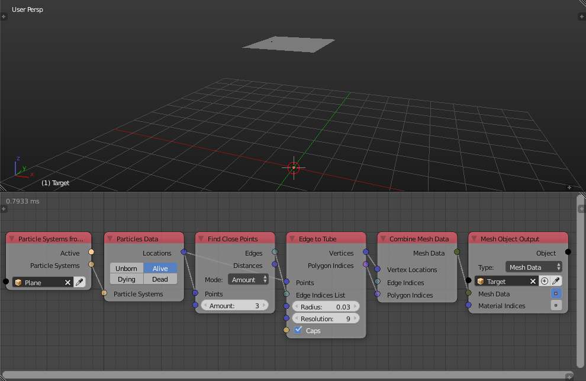
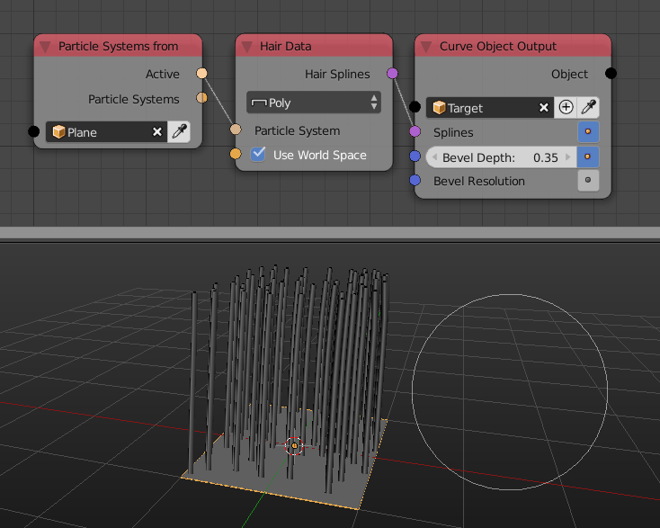

Particle System
***************

The particle system category was redesigned to be more compact and useful.

Particle Data
=============

This newly added node combines the filter particles and particle list info node. It filter particles based on the selected options, then it return particle info like their locations, velocities, sizes and so on.

Hair Data
=========

This newly added node returns the particle system hair as a list of splines.

Get Particles
=============

Get Particles node was removed.

Particle System Input
=====================

Particle System Input node was removed.

Filter Particles
================

Filter Particles node was removed.

Particle List Info
==================

Particle List Info node was removed.

Particle Info
=============

Particle Info node was removed.
