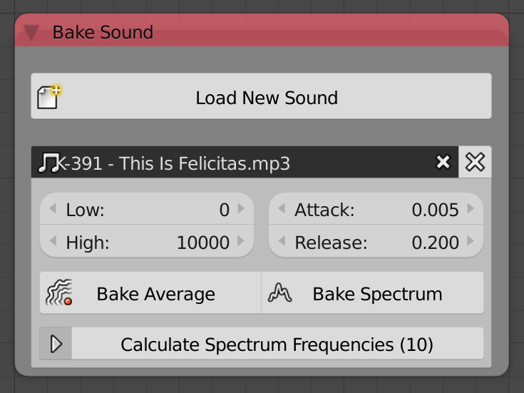
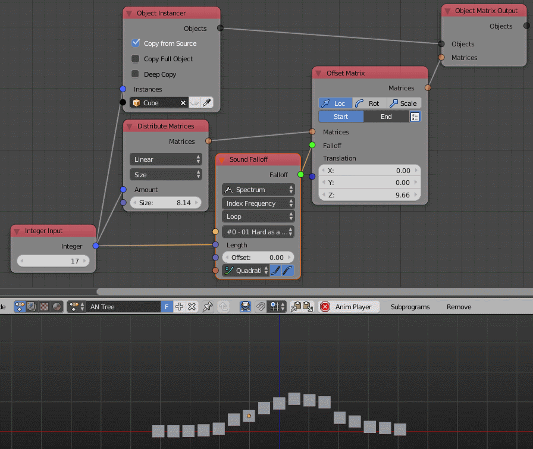
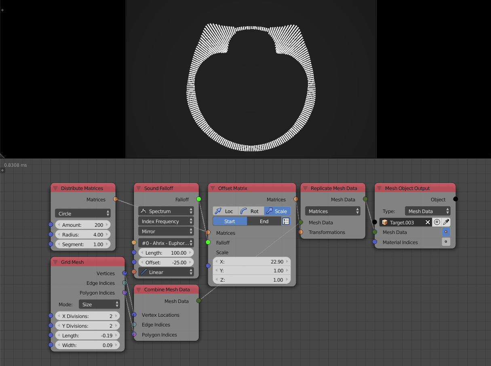

Sounds
******

Sound nodes have been redesigned visually and had some inputs renamed but functionally it is still very similar.

The *Single* and *Equalizer* sound types are called *Average* and *Spectrum* now. These names are used more often in other software as well.

Also the output of the *Evaluate Sound* node is called *Volume/Volumes* now depending on which sound type is selected.

Many common sound animations can be achieved using the new sound falloff.

.. image:: images/sound_falloff.gif

.. note::
    Often it is useful to enable the **AV Sync** option in the timeline.
