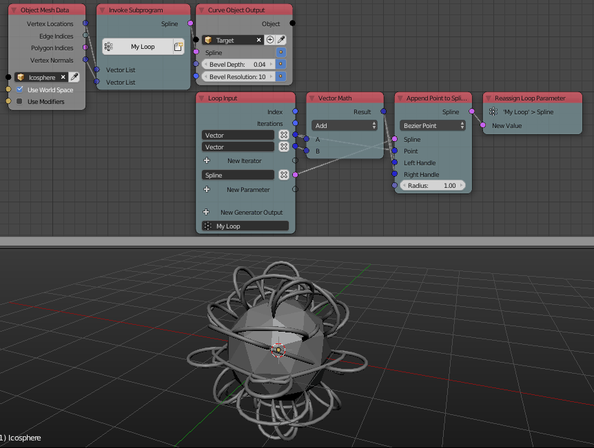
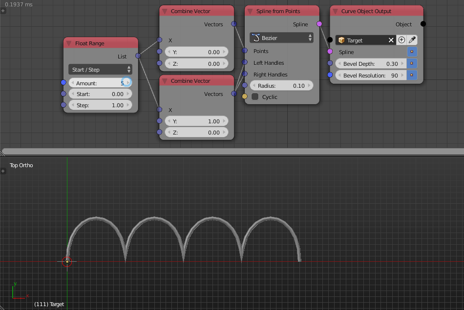
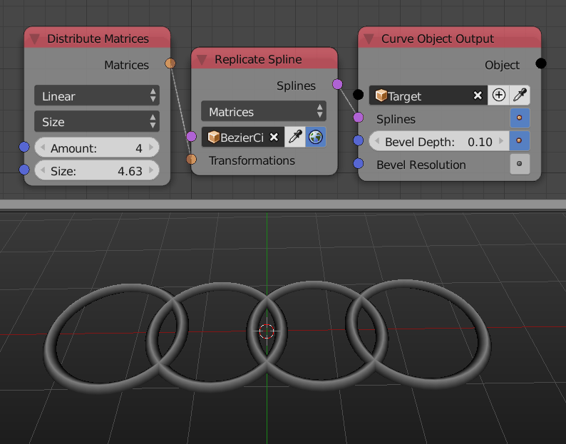
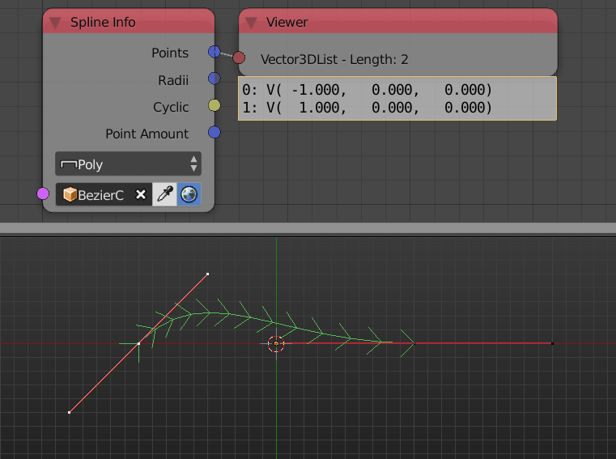
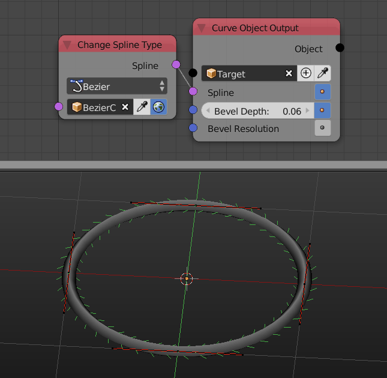
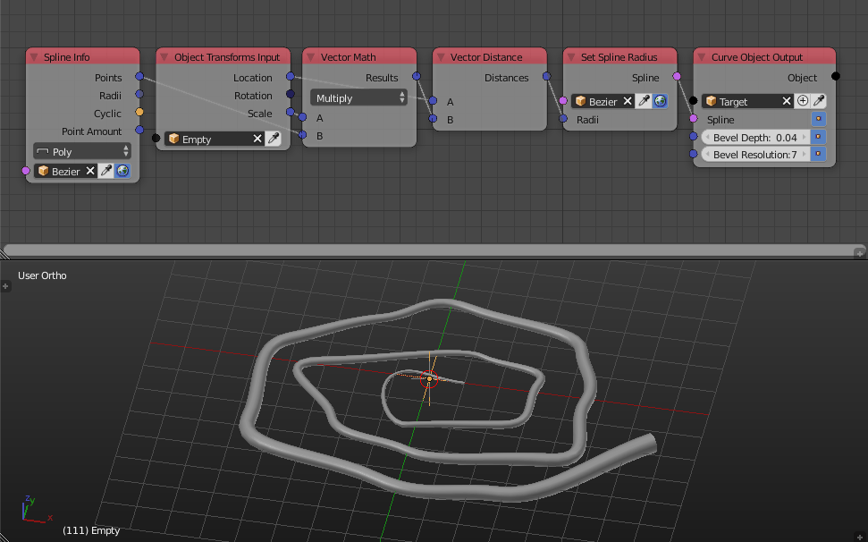
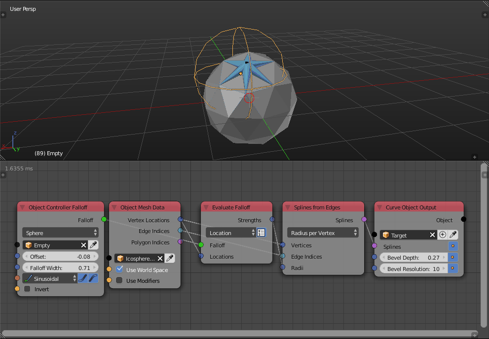
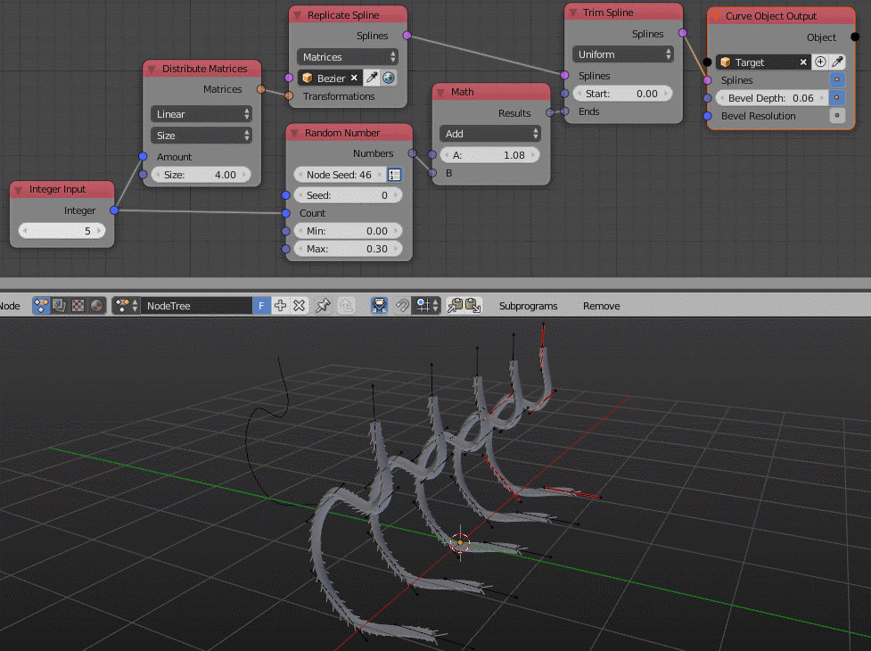

Splines
*******

Append Point To Spline
======================

A radius input was added to the node to set the radius of the newly created point.

Spline From Points
==================

You can now set the left and right handles of the spline points manually as well as setting their radius.

Replicate Spline
================

This newly added node instances splines and transforms them based on the input transformation matrices.

Spline Info
===========

Spline Info node now returns the locations of the handles of the points as well as the radii and amount of points.

Splines From Object
===================

There is now an option to return the splines in World Space.

Change Spline Type
==================

This newly added node convert spline to a poly or a bezier spline.

Set Spline Radius
=================

This newly added node set the radius of the points of the input spline.

Splines From Edges
==================

Two options to define the radius of spline points were added. The first options sets the radius per point, so it expects a float list of the same size as the vertices of the edges, the second option sets the radius per edge so it expects a float list with the same length as the edges indices list. It should be noted that the node is vectorized, so you might just enter a single float and it will be set as the radius of all points and edges and the option won't matter.

Project On Spline
=================

A new output **Distance** was added and it is equal to the distance between the input point and the projected point. In other words, it is the shortest distanced between the input point and the closest point on the spline. Or in other words, it is the length of the line that is perpendicular to the tangent at the surface and starts at the input point and ends at the point of tangency.

Trim Spline
===========

Trimming a bezier spline produces much cleaner results now. Also the node has been vectorized.

