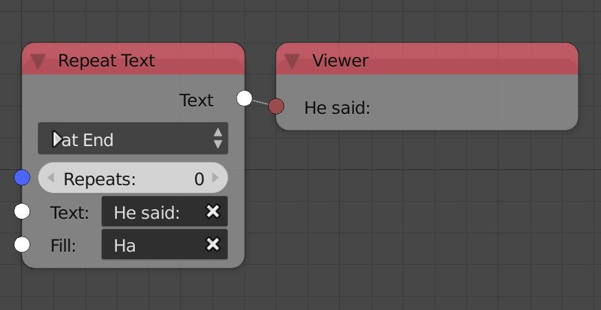
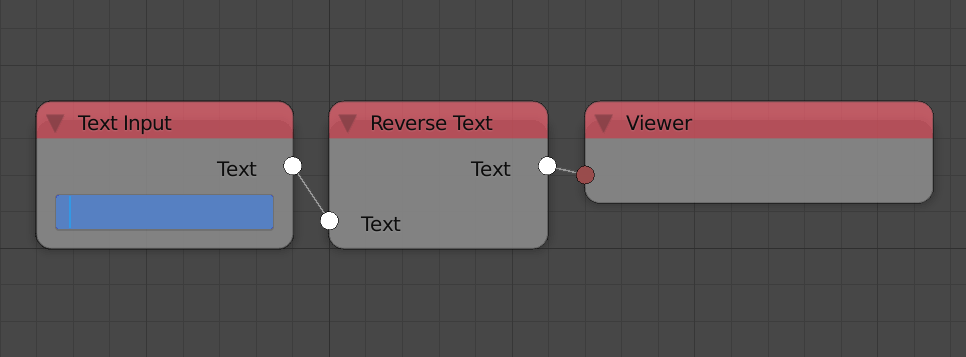

Texts
*****

The old term "String" has been renamed to "Text" in many places.

Repeat Text
===========

Fill Text node was renamed repeat text for convention.

Replicate Text
==============

Replicate Text node was removed because the same function can be done using the repeat text node by leaving the text input empty. See example above.

Reverse Text
============

Reverse Text node was added that reverse the input text's character's order.

Text Object Output
==================

Implemented Horizontal and Vertical Alignmnet.

Separate Text Object
====================

Added an advanced setting to hide relationship lines.
