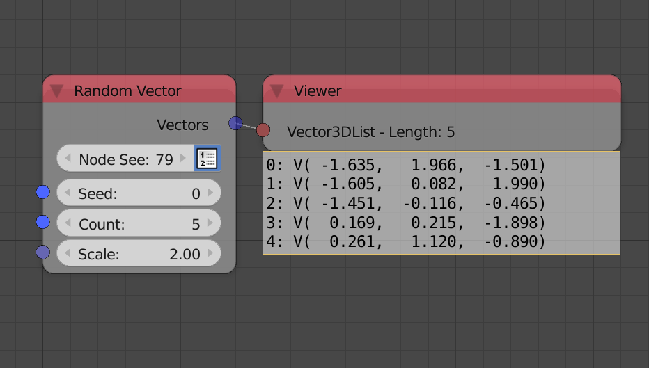
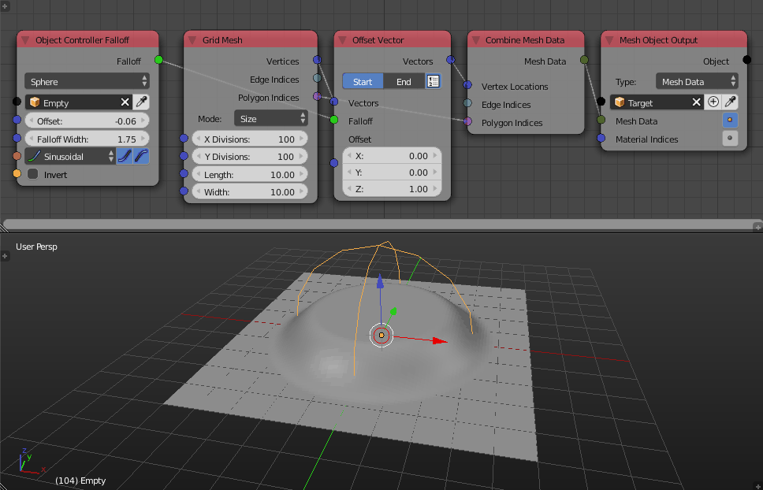

Vectors
*******

Random Vector
=============

Random Vector node can now generate a list of random vectors. This can be done by checking the **Create List** button beside the node seed. The node is now 400x faster than before. A **Normalized Vector** feature was added as an advanced setting.

Vector Wiggle
=============

Vector Wiggle node can now generate a list of vectors.

.. image:: images/vector_wiggle.gif

Transform Vector List
=====================

Transform Vector List node was removed because now the **Transform Vector** node is vectorized and can operate on lists of vectors.

Offset Vector
=============

This new node was added to make use of falloffs with vectors. The node simply translate the vector based on a translation vector, the factor of translation is controlled by a falloff.

