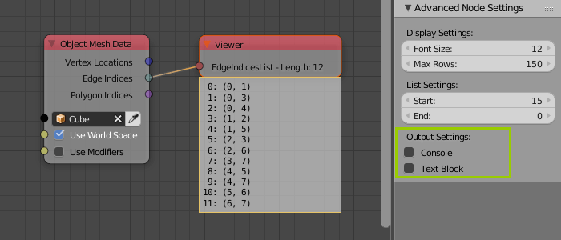
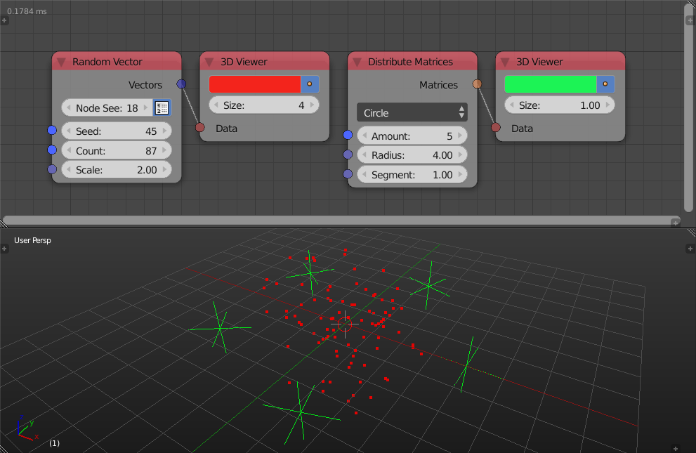

Viewer
******

Debug nodes are now called viewers.

Viewer
======

Debug, Debug List and Debug Drawer nodes were combined into a single node called Viewer. It automatically determines whether data should be drawn inline (single element) or in a box (list, or a long text), and returns information such as datatype and list length (depending on input datatypes). The result can also be output to text block or console.

.. image:: images/viewer_node.png

3D Viewer
=========

This newly added node draw point an empty like objects in the 3D viewport. If vector(s) were given, then points are drawn in their locations, if matrices were given, then empty like objects are drawn to show their orientation as well as their location.

