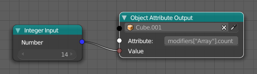

Object Attribute Output
=======================

**Object:** Choose the object where you want to set a property.

**Attribute:** This is the property path and is python related. If you don't know the property path just go to this property, right click on it, copy the data path and paste into the attribute socket.
 .. image:: copy_data_path.jpg
 
 **Value:** The value to set on the property. You can plug everything in what you want, but it only works if you match the data type of the attribute. Most of the time you need either a number or a vector.