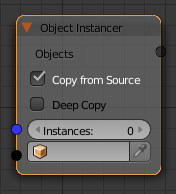

Object instancer
================

The object instancer node takes an object as input and create a specified number of instances.
The new instances with the **applied** position, rotation and scale.

Combined with loops and transformation matrices, you can achieve some pretty extrordinary results.