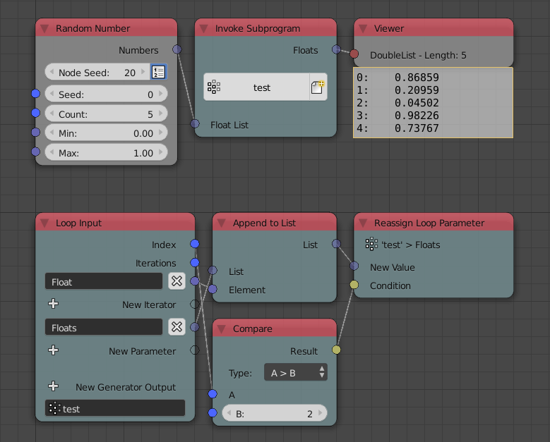
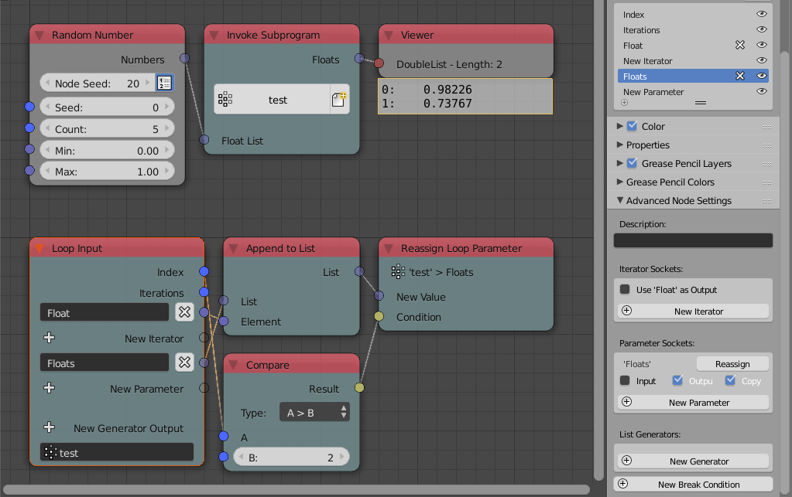
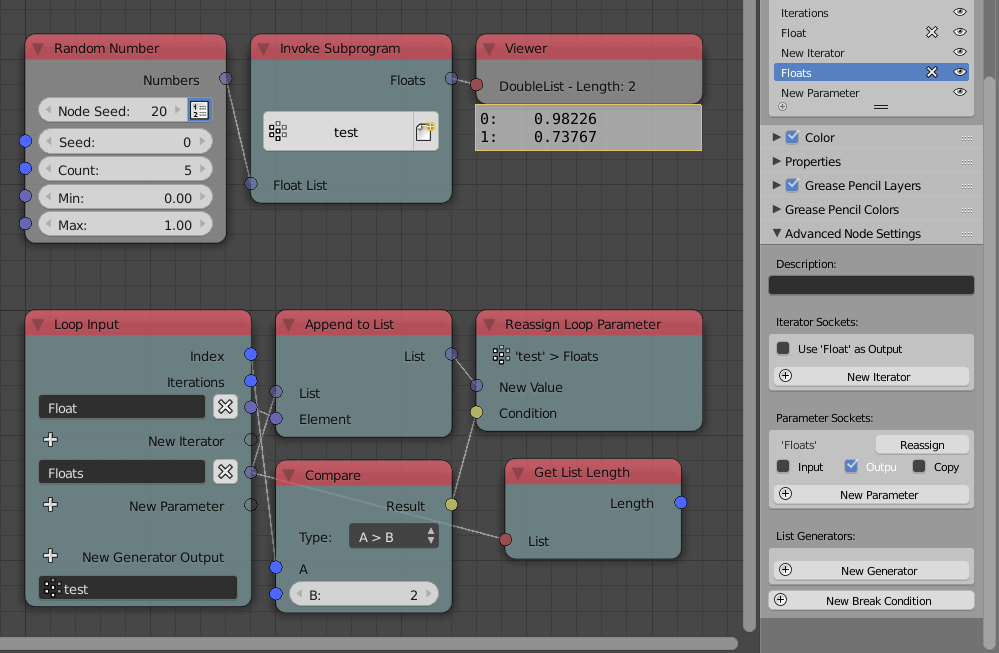
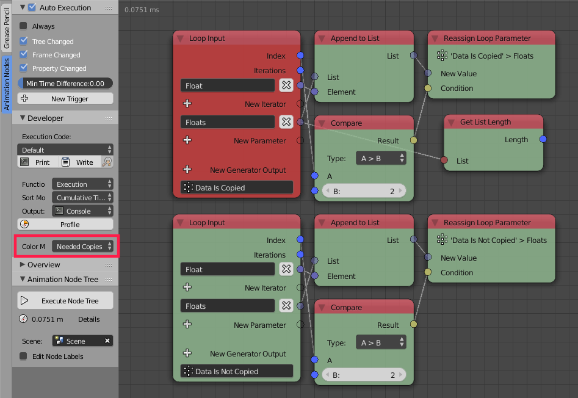
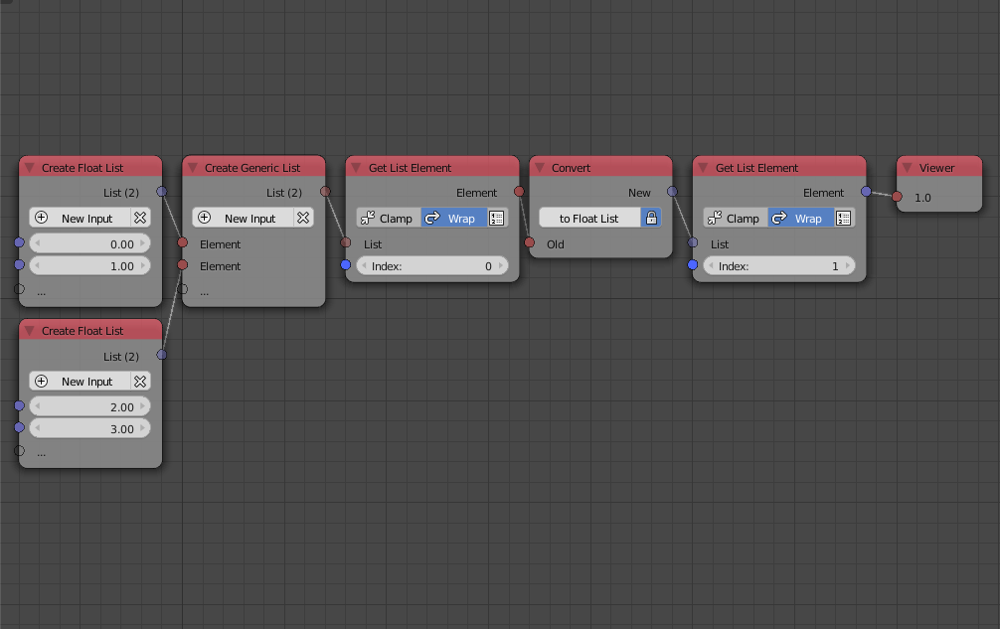

****
Data
****

Data in Animation Nodes is typed, that is, sockets have specific data types which can be identified by their color. For instance, a blue socket represents a *3D Vector* data type and a black socket represents an *Object* data type. If one attempts to connect two node sockets, unless they have the same data type or the origin type can be implicitly converted to the target type, Animation Nodes won't allow the connection.

All data types have corresponding list types, list data types have the same socket color but are somewhat transparent. For instance, the 3D Vector data type has a corresponding 3D Vector List that can exclusively store 3D Vectors.

.. image:: images/data_types.png

The output of the *Combine Vector* and *Object Input* nodes are 3D Vector and Object respectively, the output of the *Create Vector List* and *Create Object List* are 3D Vector List and Object List respectively, notice that lists sockets have the same color but are transparent.

Implicit Conversion
===================

Some data types can be *implicitly* converted to other data types, the conversion happens at the socket level. Thus, it is noted that some sockets accepts more than one data type. For instance, it is possible to connect Integers, Floats and Booleans together because all of which are numbers and can be implicitly converted to each other.

.. note::
    A boolean when converted to a number is ``1`` if ``True`` and ``0`` if ``False``. Moreover, a number when converted to boolean is ``True`` if it is non zero and ``False`` if zero. Floats are floored when converted into integers, so ``1.5`` becomes ``1`` and ``2.7`` becomes ``2``.

As of ``v2.0``, the only implicit conversions are between integers, floats and booleans and their lists.

.. image:: images/implicit_conversion.png

Dynamic Sockets
===============

Dynamic sockets are sockets that can change their type dynamically and automatically whenever needed. For instance, the *Get List Element* node takes a list and returns one of its elements, the input list socket changes its type to the type of the list you input and the output socket changes its type to the type of the elements of the the list you input.

.. image:: gifs/dynamic_sockets.gif

.. note::
    Most nodes that have dynamic sockets allows manual type change through an operator in the *Advanced Node Settings*.

Vectorized Sockets
==================

Some nodes in Animation Nodes are said to be "vectorized". Vectorization is the ability of the node to operate on lists just as it can operate on individual elements.

A vectorized node has vectorized sockets, such sockets change from list types to their element type and vise versa based on your input. For instance, the *Parse Number* node parses the input text, if I were to input a text list the input socket will automatically turn into a text list. A vectorized socket have the same color as its data type but is semi-transparent.

.. image:: gifs/parse_number.gif

.. note::
    Vectorized sockets can not be converted manually, contrary to Dynamic Sockets.

Data Copying
============

Users of Animation nodes don't have to worry about data copying as Animation Nodes automatically copy data if needed, however, sometimes, control over whether data should be copied is given to the user, such control is only needed for advanced uses of subprograms and data editing nodes. The options to control data copying is provided in the *Advanced Node Settings* of the nodes that supports it.

To have a better understanding of data copying and a possible situation where control over it might be needed, consider the following example (*The following example is rather advanced and require good knowledge of loops, you may skip it if you are just getting started*).

A loop is constructed such that it appends a float to an initially empty float list parameter provided a condition is satisfied at each iteration. The conditional appending is achieved by conditionally reassigning the float list parameter to the list after appending. *Notice that using a conditional generator may not be an option because access to the generated list at each iteration might be needed.* Now, consider the situation where we only reassign if the index is larger than 2, if the number of iterations is 5, we should expect the float list to contain two floats, but upon viewing it, we see it actually contains five elements realizing that the conditional reassigning is rendered ineffective. Why is that?

You see, the *Append To List* node appends the float to the original list because the *Loop Input* node handed it without copying (The default no-copying behavior is chosen for performance superiority.), subsequently, it doesn't matter whether we reassigned the list or not because the original data is already altered and by the end of the loop, all floats will have been appended. The solution to this is to instruct the loop to copy the data before handing it, this can be done by enabling *Copy* for the float list parameter. Upon enabling it, we see the expected two-element output float list.

Notice that Animation Nodes may enforce copying of the parameter on its own  if needed. For instance, by connecting the float list parameter to any other node, Animation Nodes feels the need to copy the data and enforce it **even if copy option is disabled**.

Animation Nodes provides a feature to visualize data copying by coloring nodes that copy data in red. This feature can be enabled by switching the coloring mode to *Needed Copied*. Below, we show two loops, one where data is copied colored in red and another where data is not copied.

Generic Data Type
=================

Animation Nodes have a special data type called *Generic*. This type can hold any other data type including lists as well as other generic data. This type is particularly useful in storing lists of lists. For instance, one could construct a generic list ``A`` composed of multiple float lists, in this case, the generic type holds lists. To use the data stored in a generic type in any node, it has to be converted to an appropriate type that Animation Nodes is familiar with, the conversion can be done using the *Convert* node. For instance, if we want to get the first float in the first float list of the list ``A``, we first get the first element of the list, convert it into a float list and get the first float from that.

The convert node converts and data type to any other data type **if possible**. The node automatically detects the input type and changes the type of the output accordingly, if you want the output to be another type, disable automatic detection by checking the lock button and choose the type manually by pressing the button next to the lock.

The converter node can convert structurally similar types to each others. For instance, a 3D Vector is structurally similar to an Euler because both are composed of three floats, same goes for their lists, that is, 3D vector List and Euler List. Moreover, a float list of three elements can be converted to a Vector or an Euler and a float list of four elements can be converted into a quaternion or a color, because quaternions and colors are composed of four floats. However, such conversion are slower than manual conversions and should be avoided if performance is desired.

.. image:: images/converter_node_example_2.png

Some nodes are capable of performing conversion on their own, an example would be the *Expression* node where it can convert its output to the socket type it is connected to if *Correct Type* option is enabled. The type can be changed manually similar to the *Convert* node by enabling the *Fixed Data Type* option and changing the type by pressing on the gear button.
