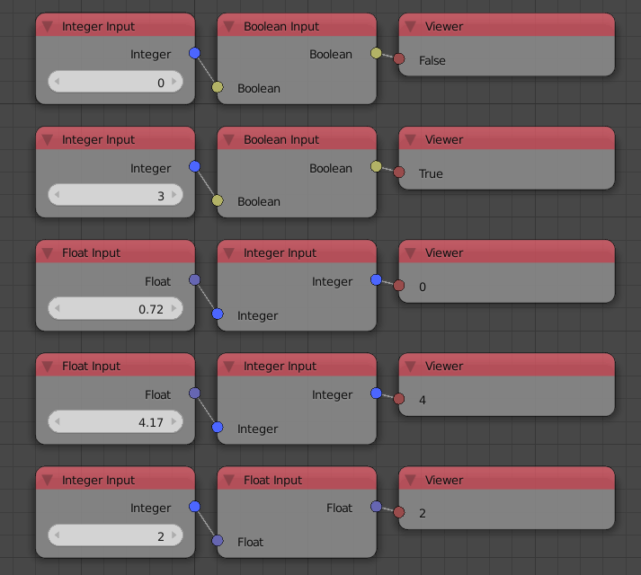
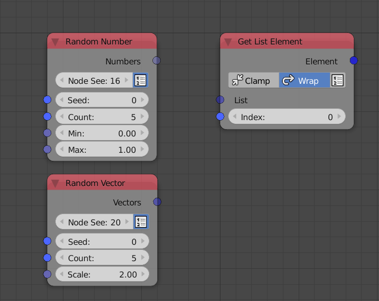
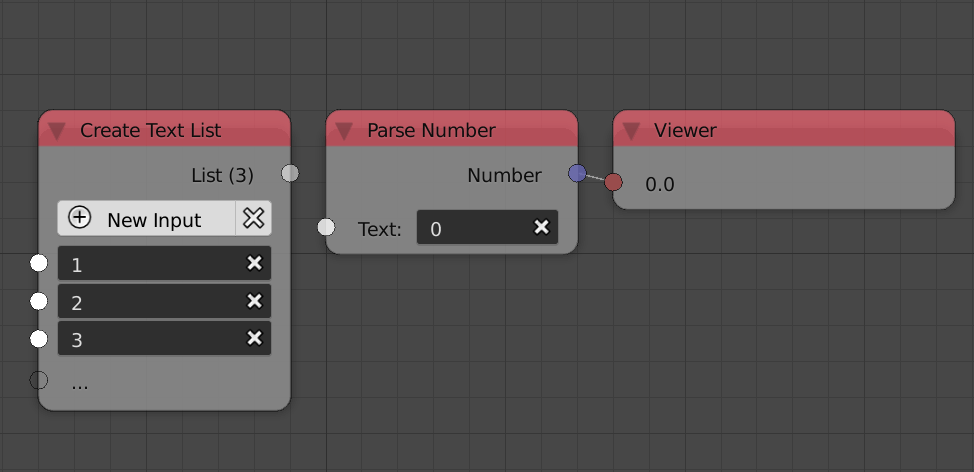
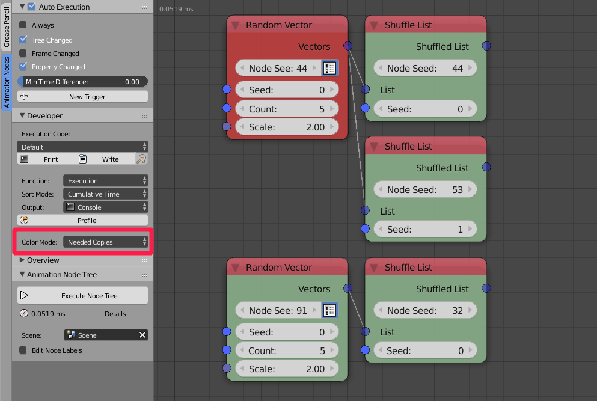

****
Data
****

Data in Animation Nodes is typed, that is, sockets have specific data type which can be identified by its color. For instance, a blue socket represents a *3D Vector* data type and a black socket represents an *Object* data type. If one attempts to connect a node output to an input, unless they have the same data type or the output can be implicitly converted to the target data type, Animation Nodes won't allow it (Implicit Conversion is discussed in the next section). All data types have corresponding list types, list data types have the same socket color but are transparent. For instance, the 3D Vector data type has a corresponding 3D Vector List that can exclusively store multiple 3D Vectors.

.. image:: images/data_types.png

The output of the *Combine Vector* and *Object Input* nodes are 3D Vector and Object respectively, the output of the *Create Vector List* and *Create Object List* are 3D Vector List and Object List respectively, notice that lists sockets have the same color but are transparent.

Implicit Conversion
===================

Some data can be *implicitly* converted to other type of data, the conversion happens at the socket level. Thus, it is noted that some sockets accepts more than one data type. For instance, it is possible to connect Integers, Floats and Booleans together because all of which are numbers and can be implicitly converted to each other.

.. note::
    A boolean when converted to a number is ``1`` if ``True`` and ``0`` if ``False``. Moreover, a number when converted to boolean is ``True`` if it is non zero and ``False`` if zero. Floats are floored when converted into integers, so ``1.5`` becomes ``1`` and ``2.7`` becomes ``2``.

As of ``v2.0``, the only implicit conversions are between integers, floats and booleans and their lists.

Dynamic Sockets
===============

Dynamic sockets are sockets that can change their type dynamically and automatically whenever needed. For instance, the *Get List Element* node takes a list and returns one of its elements, the input list socket changes its type to the type of the list you input and the output socket changes its type to the type of the elements of the the list you input.

.. note::
    Most nodes that have dynamic sockets allows manual type change through an operator in the *Advanced Node Settings*.

Vectorized Sockets
==================

Some nodes in Animation Nodes are said to be "vectorized". Vectorization is the ability of the node to operate on lists just as it can operate on individual elements.

A vectorized node include vectorized sockets, such sockets change from list types to their element type and vise versa based on your input. For instance, the *Parse Number* node parse the input text, if I were to input a text list the input socket will automatically turn into a text list. A vectorized socket have the same color as its data type but it is semi-transparent.

.. note::
    Vectorized sockets can not be converted manually, contrary to Dynamic Sockets.

Data Copying
============

Animation Nodes copied data whenever needed, and for most of the nodes, copying is not something you can control, Animation Nodes take complete control of what should or should not be copied. For instance, if you have a vector list and you shuffle it using a *shuffle* node, Animation Nodes makes the decision of shuffling the original list instead of shuffling a copy of the data. If, however, we shuffle the vector list with another *shuffle* node, Animation Nodes makes the decision of copying the data. To understand why Animation Nodes made that decision, consider the scenario where the data wasn't copied, then the first *shuffle* node will shuffle the original list and the second *shuffle* node will shuffle the already shuffled list and not the list itself. Due to this behavior, you should never assume that a node will copy or or edit original data unless explicitly specified.

Animation Nodes have an option to identify nodes that copy data, you can enable that by changing **Color Mode** to *Needed Copies* in the developer panel. Where nodes that copy data will be colored in red.

Generic Data Type
=================

Animation Nodes have a special data type called the *Generic* data type. This data type can store anything, including any data type along with their lists. Such data type is particularly useful when one want to store a list of lists, something that can't be done with normal data types. However, the downside is, Animation Nodes store the data as python objects (Not blender object) and thus it doesn't know what it stores, so if I were to use a generic as an input for some node, it won't allow it, because it isn't sure it is the type it wants. So, generics have to be converted back to a data type Animation Nodes knows. For instance, if we have a list of float lists, getting the first list of the this generic list would return a generic data type and not a float list, if I want to get the first float in the output list, I have to convert it to a float list first, this can be done using the converter node:

.. image:: images/converter_node.png

.. note::
    I could have got the element as a generic element then convert it to a float at the end, and the final output would have been the same.

The converter node converts and data type to any other data type **if possible**. The node automatically detects the input type and changes the type of the output accordingly, so if you want the output to be something different, you have to check the lock button and choose the type manually by pressing on the button next to the lock.

The converter node can convert structurally similar types to each others. For instance, a 3D Vector is structurally similar an Euler because they are both composed of three floats, so they can be converted to each other, the same goes for their lists, that is, 3D vector List and Euler List.
