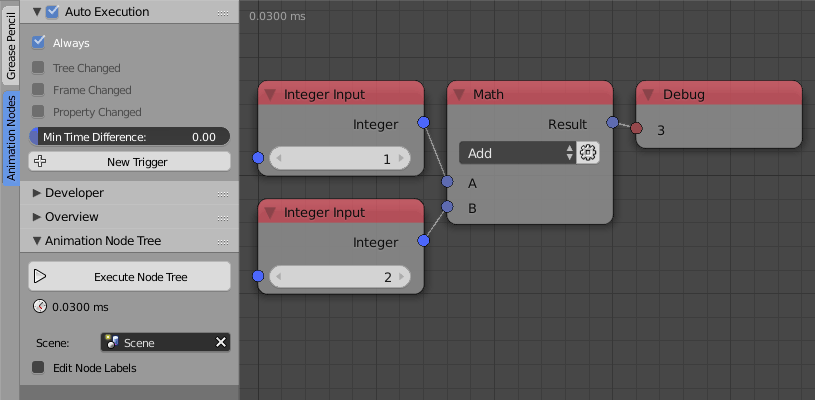
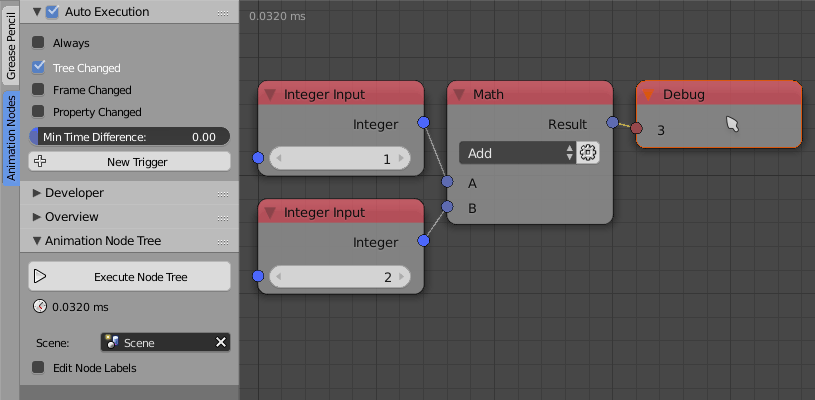
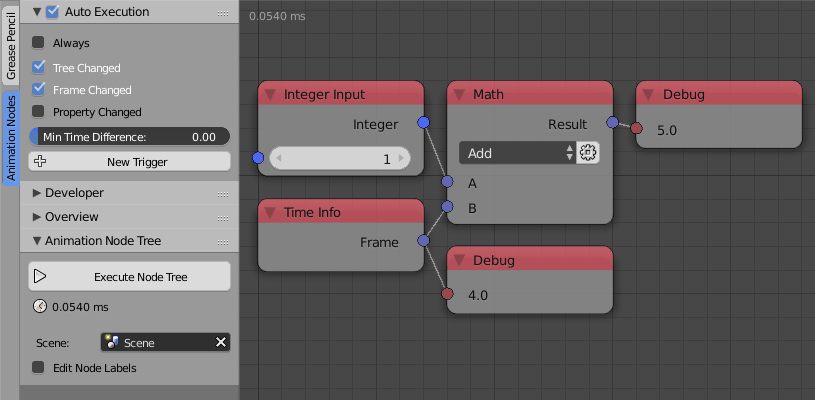
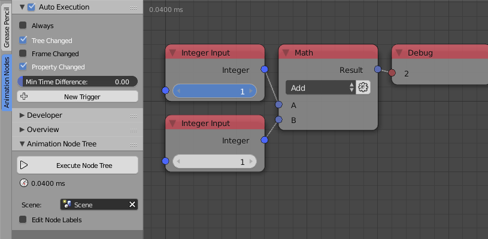
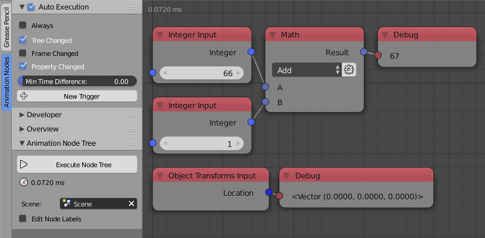
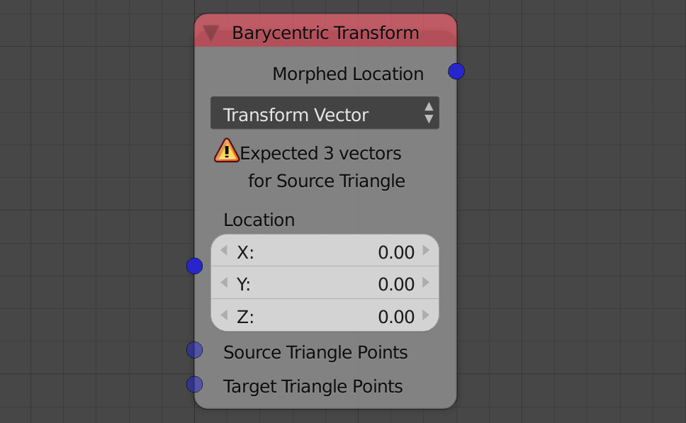
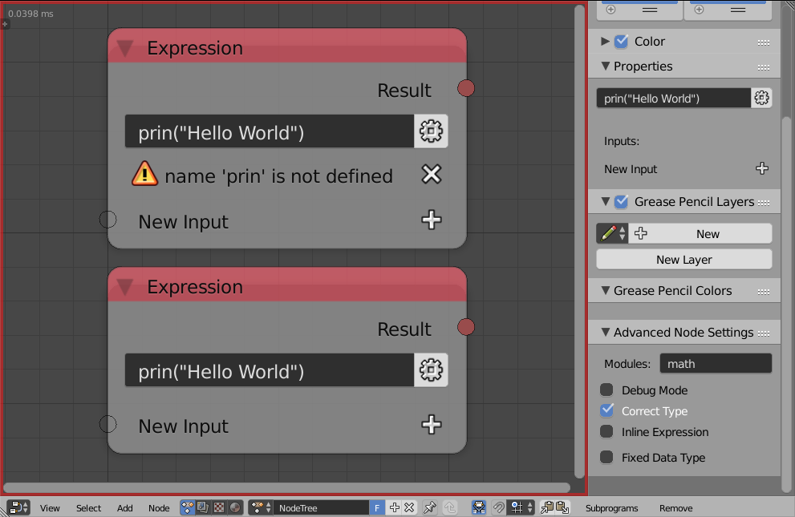

*********
Execution
*********

Animation Nodes takes your node tree and converts it into code then executes that code to see the actual result of the node tree.

You may notice that when you start using AN, a number is changing very rapidly at the top left corner of the node editor, that number is the time it took to execute the node tree.

By default, AN executes the node tree as often as possible for the best and smoothest update of the scene. However, this exhausts the CPU and slows down other areas in Blender. It doesn't make sense to execute the node tree even if nothing changes in your node tree or the scene, so executing the node tree that often may not be needed.

Animation Nodes provides an automatic and a manual execution system that suits your workflow. Possible execution systems are listed below.

Automatic Execution
===================

By default auto execution is enabled and can be found in the auto execution panel in the tool menu.

Always
------

**Always** option is enabled by default and it does what we stated before, that is, execute the node tree as often as possible. This option should never be used unless absolutely needed. A possible use for it is as follows:

- A lot of variables in the scene are changing regularly and constantly assuming AN uses them. If there are just a couple of variables then triggers should be used, see below.
- When running a simulation that needs to run constantly, for instance, when simulating a system using eulers method.

Notice how AN executes (execution time changes) constantly even if nothing is changing.

If **Always** is disabled, then you have multiple options described below.

Tree Changed
------------

If enabled, the node tree will execute every time the node tree changes, that is, a node is added or removed. You probably want to enable this after you disable **Always** because it is probable that you need to execute the node tree every time you change something in your tree.

Notice how the tree executes when I add a new node.

Frame Changed
-------------

If enabled, the node tree will execute every time the current frame of the scene changes. You probably want to enable this whenever you have a node tree that depends on time.

Notice how the tree executes whenever the current frame changes.

Property Changed
----------------

If enabled, the node tree will execute every time a property changes, that is, an input or an option of the node is changed. You probably want to enable this after you disable **Always** because it is probable that you need to execute the node tree every time you change something in your tree. Notice that changing a value in the advanced node settings won't necessarily execute the node tree even if this option is enabled.

Notice how the tree executes when I change a value in the node tree.

Minimum Time Difference
-----------------------

This value defines the time between each two consecutive executions.

Triggers
--------

Triggers are basically “watchers” that are hired by you to watch for a change in some property you told them to watch. They tell AN to execute the node tree every time the property they watch changes.

For instance, let's say I am using the location of a cube object in my node tree and I want to execute every time the location changes, so I simply add a trigger and tell it to watch for the location of the cube object.

There are two options:

- **Object Property** - An object is chosen and the property ID is defined relative to it. An example for such IDs are: ``location``, ``euler_rotation``, ``location.x`` ... .
- **Scene Property** - The path of the property has to be fully defined, for instance, ``bpy.data.objects["Cube"].modifiers["Subsurf"].levels`` which watches for the subsurface levels of a modifier.

Errors
======

During the execution of the node tree, some errors may be encountered, those errors can either be fatal or not, below is a presentation for both.

NonFatal Error
--------------

These errors are reported inside nodes and they do not stop execution, an example:

The barycentric node simply expects 3 vectors for the source inputs but none were given, to fix the error, just input a vector list. When such error occur, the node either does nothing or return the default value of the output, since the output is a vector in this case, then it is initialized by the vector ``(0,0,0)``.

Fatal Errors
------------

Fatal errors stop the execution of the whole node tree and have to be solved. Such errors occur when you try to do something with a node that the developers didn't consider, it could also be a bug and should be reported in that case. An example for such error can be seen in the expression node:

The expression node has an option to Debug the expressions you write before executing them. I disabled it for the second one and intentionally made a syntax error. The first node reported the error and didn't stop the execution (A non-fatal error), the second node however stopped the execution and colored the node editor's borders red to indicate a fatal error. To fix that error you just solve the syntax error or just enable debug option.
