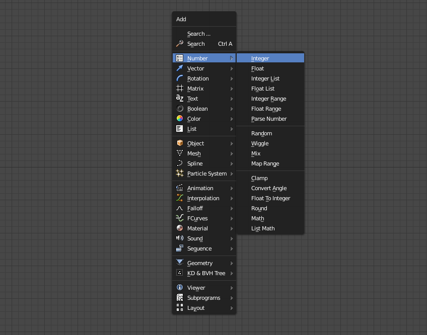
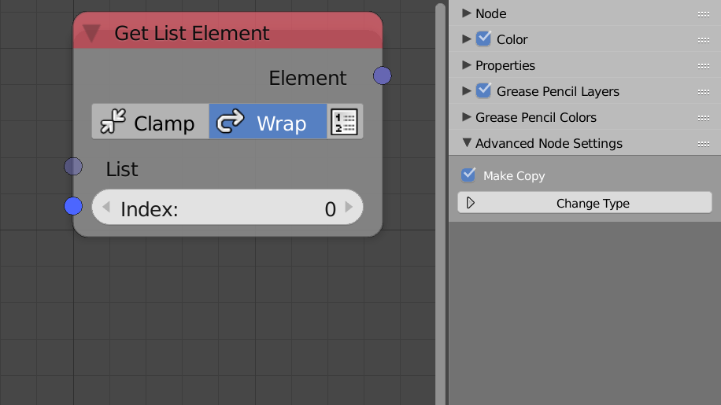

*********
Interface
*********

Much of the interface is located in the node editor in blender while some of the interface exist in other regiones like the 3D viewport.

Node Menu
=========

To add a new node, you can open the Node Menu by pressing ``Shift+A`` like other node systems. The menu contains a lot of submenus. The menu includes all nodes in AN except for passive nodes which are usually added automatically or by searching for them, such nodes are like the **Converter** and **Convert To Integer List** node.

Node Search
===========

The search box can be opened by pressing ``Ctrl-A``, it enables you to quickly find and insert nodes by their names. Some nodes have multiple search tags to make it easier to find them. Search box can find any node in AN even if they were passive from the node menu.

.. image:: images/search_menu.png

Node Settings
=============

Nodes include multiple settings types, settings that regularly changes are drawn inside nodes directly for faster workflow, settings that doesn't change regularly are drawn in a custom panel in the properties menu to avoid clustering the UI.

Inside the Node
^^^^^^^^^^^^^^^

Settings that regularly changes are drawn inside nodes, for example:

.. image:: images/inside_node_settings.png

Advanced Node Settings
^^^^^^^^^^^^^^^^^^^^^^

Settings that doesn't change regularly are drawn in a custom panel called
**Advanced Node Settings**. The settings inside are always for the currently
active node.

Node Panel
^^^^^^^^^^

Sockets (Inputs and Outputs) of every node can be hidden or unhidden through this panel by pressing the "eye" next to the desired socket. Some nodes like subprograms inputs allows reordering of sockets by using the **arrows**.
You can also specify the name and lable of the node from this panel. Name has to be unique.

  .. image:: images/node_panel.png

Tree Settings
=============

The tool menu in the node editor in Animation Nodes contain settings and information regarding the nodetree itself and not individual nodes.

.. image:: images/nodetree_menu.png

Auto Execution Panel
^^^^^^^^^^^^^^^^^^^^

Includes options related to auto execution of the node tree.

Developer
^^^^^^^^^

Includes options related to inspecting, profilling and debugging node trees.

Overview
^^^^^^^^

Includes some information about the node tree like the execution time. The statistics button draws a table that include information about the number and types of nodes in the node tree.

Animation Nodes Tree
^^^^^^^^^^^^^^^^^^^^

This panel includes manual execution button and the scene that the node tree belongs too.

- **Edite Node labels** - If enabled, a text box will appear in every node that lets you edit the label of the node. This is helpful if you want to organize you node tree after you finish building it.

3D View
=======

  .. image:: images/3dview_menu.png

ID
^^

Includes some options related to some specific **ID Key** node.

Data Input
^^^^^^^^^^

Displays the the data input nodes (like integer input) inside the panel if Show In Viewport is enabled. (See one of the data input nodes)
