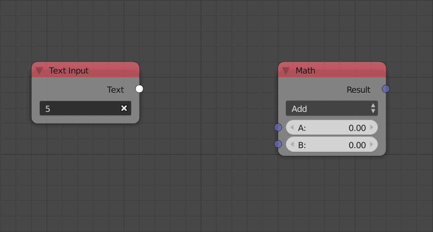
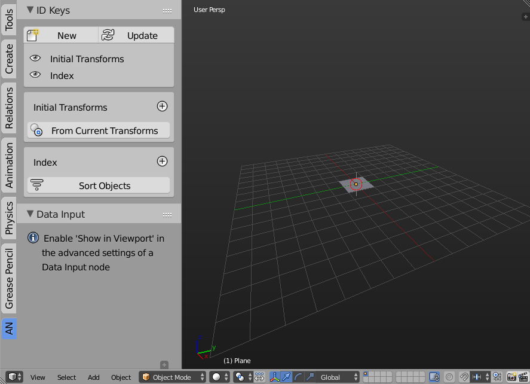
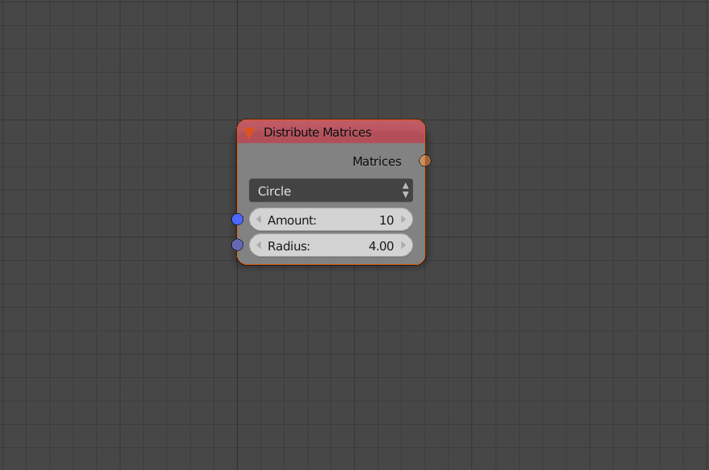
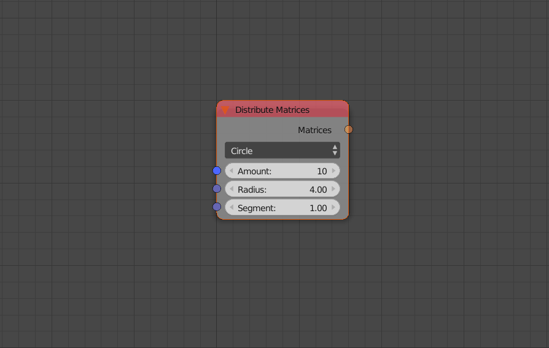
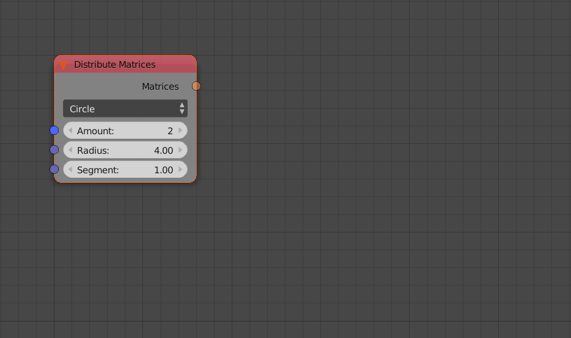
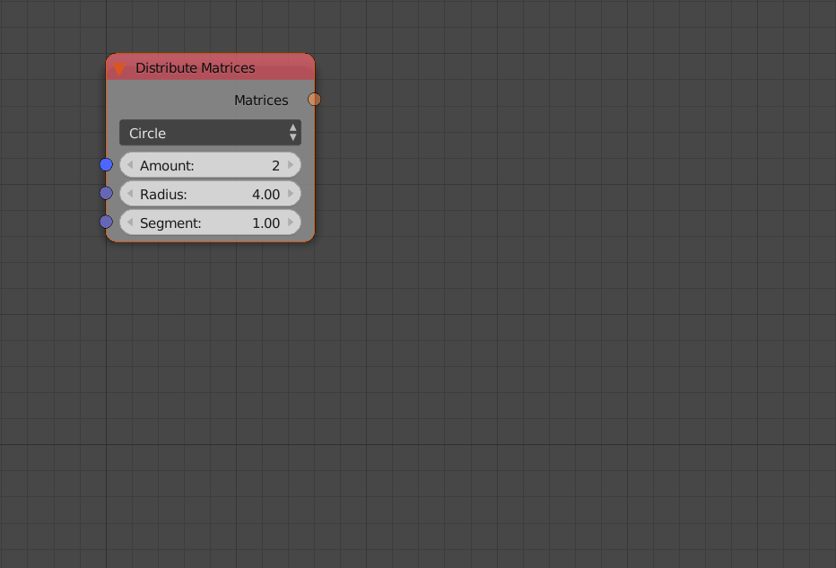
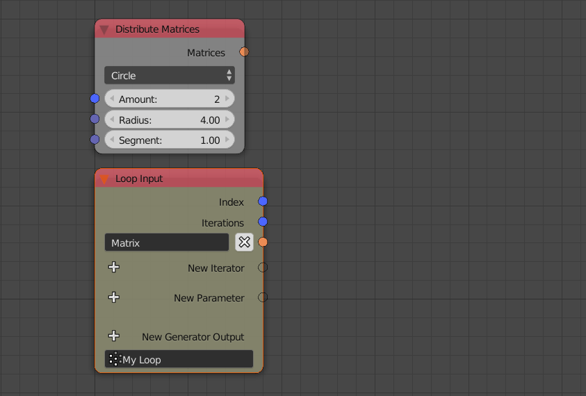

*********
Interface
*********

Much of the interface is located in the node editor while the rest of the interface exists in other regions like the 3D viewport.

.. image:: images/node_editor.png

Animation Nodes have its own node editor which you can select by clicking on the Dope Sheet icon |dope-sheet-icon| in the tool bar. A new node tree can be added by clicking on the **New** button.

.. |dope-sheet-icon| image:: images/dope_sheet_icon.png
                     :width: 20pt

Node Menu
=========

To add a new node, you can open the Node Menu by pressing ``Shift+A`` just like other node systems. The menu contains a group of submenus each of which contains a list of node categorized by their type. The menu includes all the nodes in Animation Nodes except for some *passive nodes*. Passive nodes are nodes that can only be added through the **Search Menu** which is covered in the next section.

.. image:: images/node_menu.png

Passive nodes are usually added automatically whenever needed, for instance, *Parse Number* node is automatically added when attempting to connect a text type to a number type:

Search Menu
===========

The search menu can be opened by pressing ``Ctrl+A``, it enables you to quickly find and insert nodes by their names. Some nodes have multiple names for faster access. Moreover, some nodes have the so called "search tags" which are option presets, for instance, searching for "Add, subtract, multiply, ..." will add a math node and set it to the required type. The search menu can find any node in Animation Nodes even if it was passive.

.. image:: images/search_menu.png

Node Settings
=============

Inside the Node
---------------

Options that users use often are drawn inside nodes, for example:

.. image:: images/inside_node_settings.png

Math operation and distribution patterns are node options.

Advanced Node Settings
----------------------

Options that users don't use often are drawn in a custom panel called **Advanced Node Settings** to avoid clustering the UI.

.. image:: images/advanced_node_settings.png

Node Panel
==========

Sockets (Inputs and Outputs) of nodes can be hidden or unhidden through this panel by pressing the "eye" next to the desired socket. Some nodes like subprograms, allows reordering of sockets by using the **arrows**. You can also change the name and label of nodes in this panel, names has to be unique.

.. image:: images/node_panel.png

Tree Settings
=============

The tool menu in the node editor in Animation Nodes contain settings and information regarding the nodetree itself. All of the options will be explained in other sections of the getting started guide.

.. image:: images/nodetree_menu.png

Auto Execution Panel
--------------------

Include options related to auto execution of the node tree.

Developer
---------

Include options related to inspecting, profiling and debugging node trees.

Overview
--------

Include some information about the node tree like the execution time. The statistics button draws a table that include information about the number and types of nodes in the node tree.

Animation Nodes Tree
--------------------

This panel includes manual execution button and the scene that the node tree belongs to.

- **Edit Node labels** - If enabled, a text box will appear in every node that lets you edit the label of the node. This is particularly helpful if you want to organize you node tree after you finished building it.

3D View
=======

ID
--

Includes some options related to the :doc:`/user_guide/nodes/object/object_id_key` node.

Data Input
----------

Displays the the data input nodes inside the panel if **Show In Viewport** is enabled.

.. include:: /includes/nodes/show_in_viewport.rst

Shortcuts
=========

U
-

Upon pressing **U** while selecting a node, a panel that include both the *Advanced Node Settings* and the *Socket Settings* of the selected node will appear. This is considered as a more robust way to edit the settings instead of promoting the **N** menu:

W
-

Upon pressing **W** while selecting a node, a pie menu will be promoted that include up to three operators depending on the selected node, those operators include:

Data Input
^^^^^^^^^^

This is only available if the node has  **Visible** inputs. It will create an *Input Node* for the selected node's input socket (or the only existing one):

Viewer
^^^^^^

This is only available if the node has  **Visible** outputs. It will create a *Viewer Node* for the selected node's output socket (or the only existing one):

Loop Through
^^^^^^^^^^^^

This is only available if the node has  **Visible** list outputs. It will create a *Loop Input Node* with an iterator of the same type as the selected node's output socket (or the only existing one), as well as create an *Invoke Node* pointing to the created loop connecting the selected node's output to the created iterator:

Create Invoke Node
^^^^^^^^^^^^^^^^^^

This is only available if the node is a *Loop Input Node*. It creates an *Invoke Node* pointing to the selected loop:

E
-

Upon pressing **E** while selecting a node, a pie menu will be promoted that include three operators that allows selecting relatives of the selected node, those operators include:

Selected Dependencies
^^^^^^^^^^^^^^^^^^^^^

This will select all the nodes that the selected node depends upon, that is, nodes connected to its inputs. Green in the illustration below.

Selected Dependent Nodes
^^^^^^^^^^^^^^^^^^^^^^^^

This will select all the nodes that uses the selected node, that is, dependent on it. Orange in the illustration below.

Selected Network
^^^^^^^^^^^^^^^^

This will select all dependencies and dependent nodes as well of that of them of the selected node, that is, any node connected to the selected node. Blue in the illustration below.

.. image:: images/e_shortcut.png

Tab
---

**Tab** if pressed while selecting a *Loop Input Node*, will select all the *Invoke Nodes* pointing to it. And if pressed while selecting an *Invoke Node*, will select the *Loop Input Node* of the loop it is pointing to. This works across node trees, so if a loop is defined in another node tree, Animation Nodes will switch to that node tree, in that case, pressing **Tab** again will---in some scenarios---switch back to the node tree you were originally at.

Ctrl + Shift + Q
----------------

This will disable *Auto Execution*.
