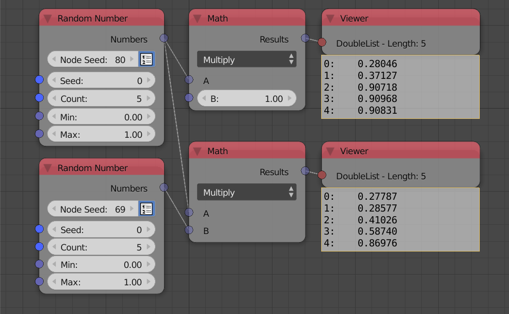

*************
Vectorization
*************

Some nodes in AN are said to be "vectorized". Vectorization is the ability for the node to operate on lists just as it can operate on individual values. Vectorization can either be element wise, that is, two equal lists can be operated on element by element or it can be streamed, that is, a value is reapeated to match the length of a list and then the operation is done element by element.

The first math nodes is streamed, it simply multiply every value in the float list by 1. The second math node is elementwise, it return a list of the same length where the first element is the multiple of first elements in both lists, second element is the multiple of the second elements in both list and so on.

Vectorized nodes can be identified from their sockets, their sockets are semitransparent (More solid than lists, see the second socket in the first math node in the example above).
