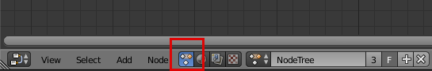
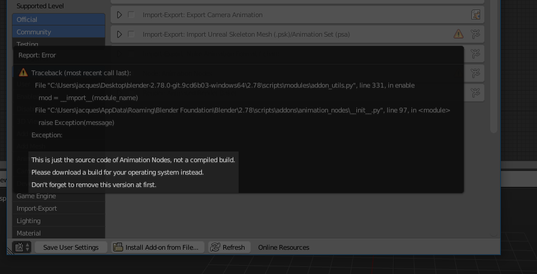

Installation
************

How to Install?
---------------

0. `Uninstall <#how-to-uninstall>`_ any old version of Animation Nodes. Having it installed multiple times for the same version causes conflicts.

1. Download a recent build for your operating system from the `release page <https://github.com/JacquesLucke/animation_nodes/releases>`_. If no build suits you, you will have to compile it yourself (see :doc:`/dev_guide/index`) or contact the developer.

2. Open Blender (preferably the newest version).

3. Go to the *User Preferences* in the *Addon* tab.

4. Click *Install from File* and choose the `zip` file you downloaded.

5. Activate the add-on and you are **done**.

You can now find the Animation-Nodes editor in the node editor.

.. note::
    Checkout the troubleshooting section below if you have any installation problems.

How to Uninstall?
-----------------

1. Disable the addon and save the user preferences.

2. Restart Blender and remove Animation Nodes.

.. important::
    Animation Nodes must not be active in the session in which it will be removed. This is because some files cannot be removed once they are loaded. This usually is not a problem with other addons because they don't use Cython---A technology Animation Nodes is built on.

Troubleshooting
---------------

If Animation Nodes failed to start, it should show an **error message**. Please read it, it often contains information on what the issue is.

Some of this issues include:
~~~~~~~~~~~~~~~~~~~~~~~~~~~~

- Animation Nodes may depend on features that only exist in recent versions of Blender, in that case, make sure to update your `Blender <https://www.blender.org/download/>`_ version. Using experimental Blender builds is not recommended as it might accompany changes that the developer is not aware of.

- Animation Nodes builds are specific to operating systems, for instance, windows builds will not operate on linux systems, so, make sure that you have downloaded a build specific to your operating system (Linux, Windows, macOS). It should be noted that **Linux** builds does not seem to work on every linux distribution, an issue that we haven't been able to solve yet. Therefor, we provide multiple Linux `builds <http://graphicall.org/?keywords=Animation+Nodes>`_ that you can try.

- Windows users may encounter errors due to missing runtimes, in that case, try installing `Visual C++ Redistributable Package <https://www.microsoft.com/en-US/download/details.aspx?id=48145>`_.

- Animation Nodes builds are specific to python versions, that is, they only operates on a system with python version identical to that it was compiled with. Builds are compiled with the same python version used in the latest official Blender version. If one wanted to use a different python version, one will have to compile Animation Nodes oneself (see :doc:`/dev_guide/index`).

- Animation Nodes depends on `numpy <http://www.numpy.org/>`_, a python module that is included with official Blender builds. If you have downloaded an unofficial Blender version (for instance, from a package manager), it is possible that *numpy* will not be included in the build, and this should be clear from the error message. In that case, you can either download a Blender build that include *numpy* (preferably an `official <https://www.blender.org/download/>`_ one) or install *numpy* yourself through a package manager or manually.

If you still haven't managed to install Animation Nodes, you have two options:

1. Open a `new issue <https://github.com/JacquesLucke/animation_nodes/issues/new>`_ on Github and ask for help. Please provide the relevant data about your system (OS, Python version, Blender version, error messages, ...).
2. Compile Animation Nodes yourself (see :doc:`/dev_guide/index`).
