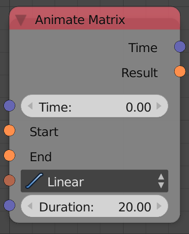
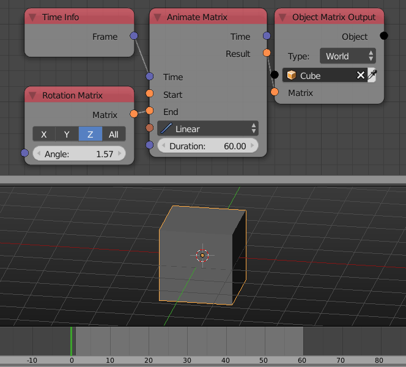

Animate Matrix
==============

Description
-----------

This node mixes between two matrices where the factor for mixing is the time mapped to an input interval *Duration*.

Inputs
------

- **Time** - A time or the factor for mixing.
- **Start** - A value to start the animation with or the first input for mixing.
- **End** - A value to end the animation with or the second input for mixing.
- **Interpolation** - An Interpolation(Function) to evaluate the time at (Linear will just use the input time).
- **Duration** - The duration of the animation or the interval to map the time to or the value the time is divided by.

Outputs
-------

- **Time** - The different between the input time and the duration (Isn't affected by the input interpolation).
- **Result** - The value of the animation evaluated at the input time or the result of mixing.

Advanced Node Settings
----------------------

- N/A

Examples of Usage
-----------------

