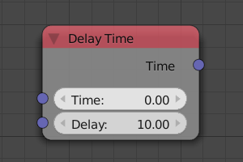
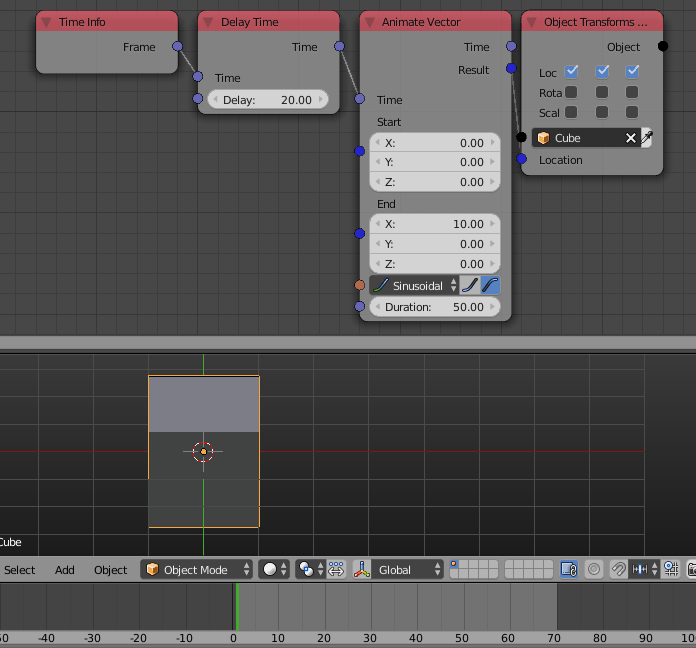

Delay Time
==========

Description
-----------
This node subtracts the *delay* input from the *time* input.

The essence of this subtraction is changing the frame at which an animation will start when using one of the animation nodes or using the output in a custom animation node tree.

Inputs
------

- **Time** - An input time.
- **Delay** - A value to subtract from the time or the frame at which the animation will start.

Outputs
-------

- **Time** - The delayed time.

Advanced Node Settings
----------------------

- N/A

Examples of Usage
-----------------

