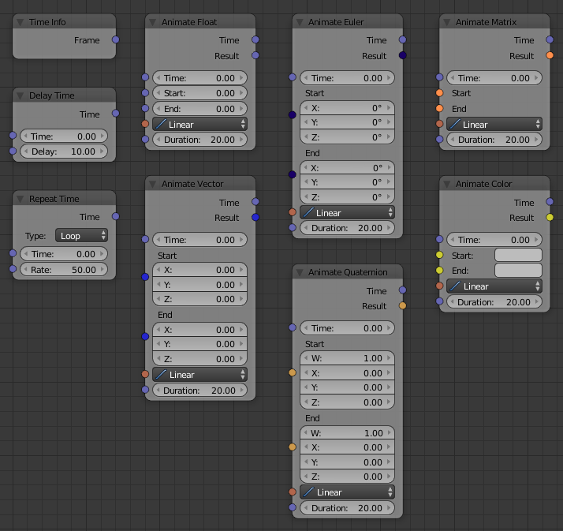

Animation
=========

.. toctree::
   :titlesonly:

   Time Info <time_info>
   Delay <delay_time>
   Repeat <repeat_time>
   Animate Float <animate_float>
   Animate Vector <animate_vector>
   Animate Euler <animate_euler>
   Animate Quaternion <animate_quaternion>
   Animate Matrix <animate_matrix>
   Animate Color <animate_color>

