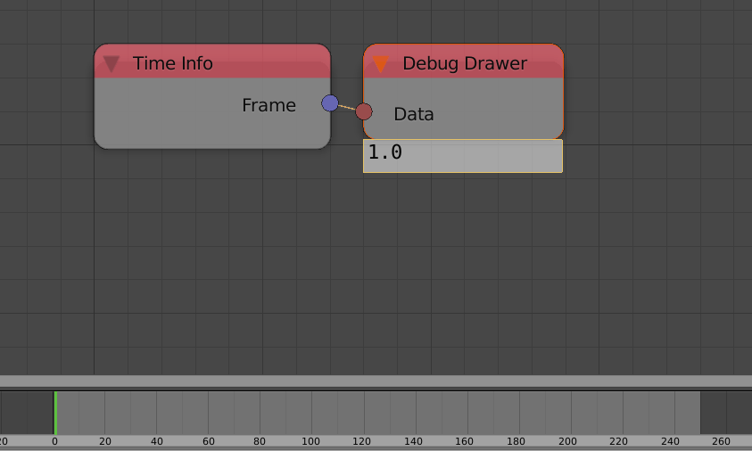

Time Info
=========

Description
-----------
This node returns some information about scene playback.

.. image:: images/time_info_node.png
   :width: 160pt

Inputs
------

- **Scene** - A scene to return its playback information.

Outputs
-------

- **Frame** - Current frame.It is a float because of existance of subframes.
- **Start Frame** - First frame of the scene playback range.
- **End Frame** - Last frame of the scene playback range.
- **Frame Rate** - The frame rate of the playback.

Advanced Node Settings
----------------------

- N/A

Examples of Usage
-----------------

