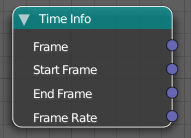

Time Info Node
==============

**Frame:** Returns the final frame (time remapping is applied).

**Start Frame:** Start frame of the scene.

**End Frame:** End frame of the scene.

**Frame Rate:** Frame Rate in this Scene (24 by default).
