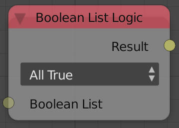
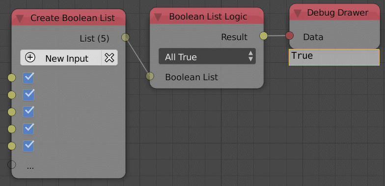

Boolean List Logic
==================

Description
-----------
This node returns ``True`` if all of the values are ``True`` or ``False`` if all
the values are ``False`` and the inverse of the operations.

Demonstration
-------------

- **All True**
    Returns True if all the booleans are True and False if not.

- **All False**
    Returns True if all the booleans are False and False if not.

- If you used a **Not** Operation that means the output is the inverse of the boolean.

Inputs
------

- **Boolean List** - A list of booleans.

Outputs
-------

- **Result** - The result of the operation.

Advanced Node Settings
----------------------

- N/A

Examples of Usage
-----------------

