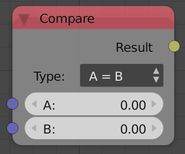
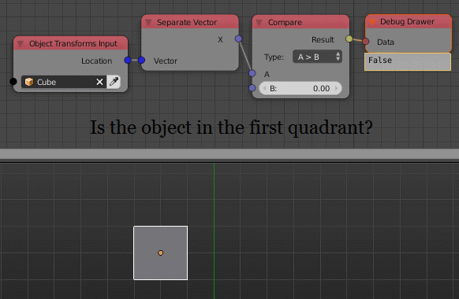

Compare
=======

Description
-----------
This node compares 2 values using standard mathematical inequalities like
>,<,<=,>=,=,=! and return ``True`` if it was satisfied and ``False`` if not.

Inputs
------

- **A** - The first value.
- **B** - The second value.

Outputs
-------

- **Result** - The resulted boolean.

Advanced Node Settings
----------------------

- **Change Type** - Change the input type to other data type.

Note
----

- **A != B**
    Means A does not equal to B

- **A is B**
    Unlike A = B, This check if the inputs are the same object.
    Means if 2 integer lists have the same value and length, tt will still
    return ``False`` because they are not the same object even though
    they have the same elements.

Examples of Usage
-----------------

