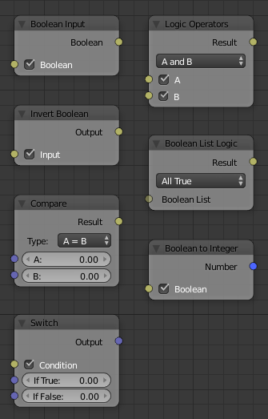

Boolean
=======

.. toctree::
    :maxdepth: 1

    Boolean Input <boolean_input>
    Boolean to Integer <boolean_to_integer>
    Invert Boolean <invert_boolean>

    Switch <switch>
    Compare <compare>
    Logic Operators <logic_operators>
    Boolean List Logic <boolean_list_logic>

