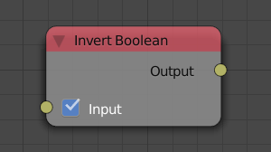
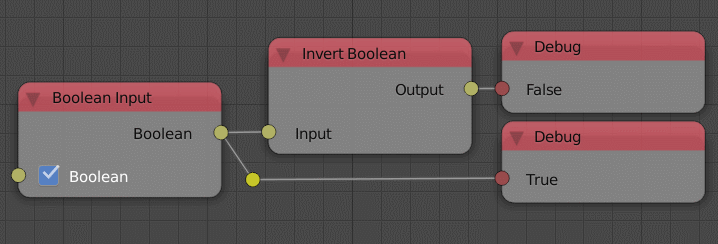

Invert Boolean
==============

Description
-----------
This node invert the boolean. In other word, if the input is ``False`` it 
becomes ``True`` and if it was ``True`` it will be ``False``.

Inputs
------

- **Input** - The input boolean.

Outputs
-------

- **Output** - The inverted boolean.

Advanced Node Settings
----------------------

- N/A

Examples of Usage
-----------------

