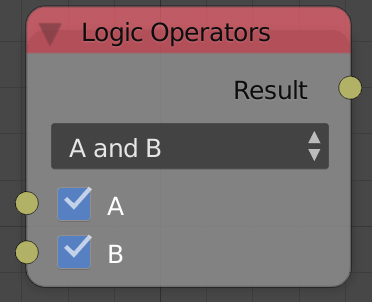
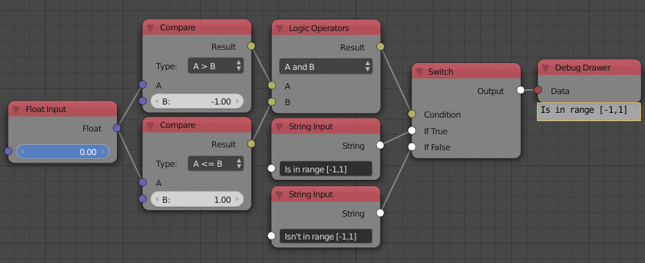

Logic Operators
===============

Description
-----------
This node perform standard logical gates operations like ``And, Or, Xor``.

Demonstration
-------------

- **A and B**
    Both A and B have to be ``True`` in order to return ``True``.
    e.g. ``True and False = False``, ``False and False = False``, ``True and True = True``.

- **A or B**
    If A or B are ``True`` or both are ``True`` then the output is ``True``.
    e.g. ``True or True = True``, ``True or False = True``, ``False or False = False``.

- **A xor B**
    If A and B are different then the output is ``True``.
    e.g. ``True xor True = False``, ``True xor false = True``, ``False xor False = False``.

- If you used a **Not** Operation that means the output is the inverse of the boolean.

Inputs
------

- **A** - The first boolean.
- **B** - The second value.

Outputs
-------

- **Result** - The result of the operation.

Advanced Node Settings
----------------------

- N/A

Examples of Usage
-----------------

