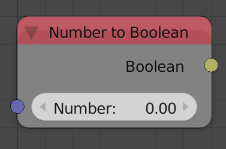
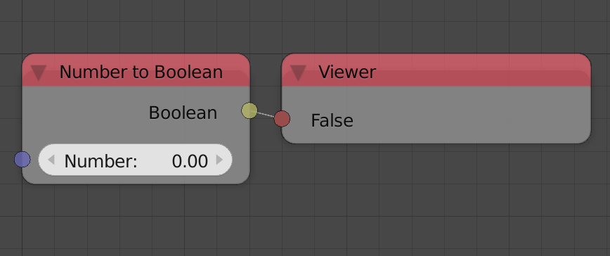

Number To Boolean
=================

Description
-----------

This node return False if the input number is zero and True if otherwise.

Inputs
------

- **Number** - A number.

Outputs
-------

- **Boolean** - A boolean which is False if the input number is zero and True if otherwise.

Advanced Node Settings
----------------------

- N/A

Examples of Usage
-----------------

