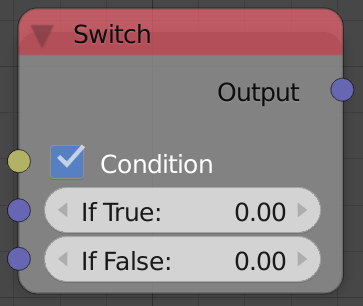
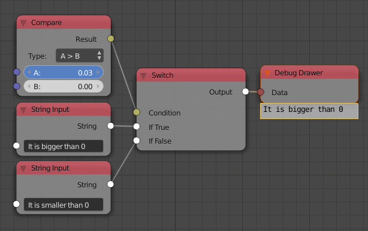

Switch
======

Description
-----------
This node return the first input if the condition was ``True`` and the second
input if the condition was ``False``.

Inputs
------

- **Condition** - A boolean that define the output.
- **If True** - The value that should be the output if the condition is ``True``.
- **If False** - The value that should be the output if the condition is ``False``.

Outputs
-------

- **Output** - The first value if ``True`` and the second value if ``False``.
- **Other** - The first value if ``False`` and the second value if ``True``.

Advanced Node Settings
----------------------

- **Change Type** - Change the input type to other data type.

Note
----

The type of the node change automatically when you input another data type.

Examples of Usage
-----------------

