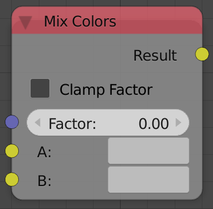
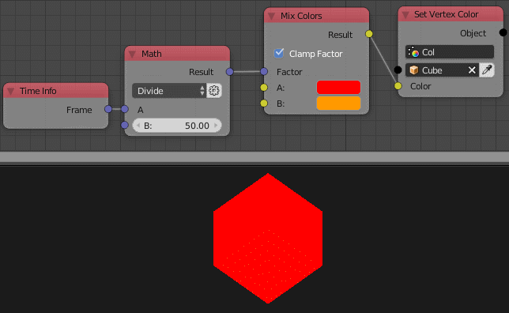

Mix Colors
==========

Description
-----------

This node mixes between 2 colors based on a factor.

Inputs
------

- **Factor** - A float that controls the amount of each color input to the output. 0 means the first color only and 1 means the second color only.

Outputs
-------

- **Result** - The result of mixing the two colors by the factor.

Advanced Node Settings
----------------------

- N/A

Note
----

The way *Mix Colors* works, A factor that is larger than 1 won't be clamped but rather multiplied to the second color. That's why the node has an option to *Clamp Factor*. So if *Clamp factor* is enabled, any factor that is larger than 1 will return the second color.

Examples of Usage
-----------------

