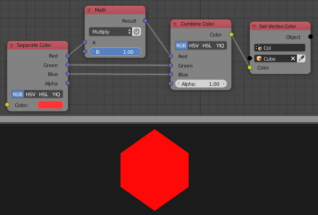

Separate Color
==============

Description
-----------
This node decomposes an input color data and output its individual channels.
It supports RGB, HSV, HSL and YIQ color models. All are in linear color space.

.. image:: images/separate_color_node.png
   :width: 160pt

Inputs
------

- **Color** - The input color data to decompose.

Outputs
-------

Based on the choosen color model.

Advanced Node Settings
----------------------

- N/A

Examples of Usage
-----------------

