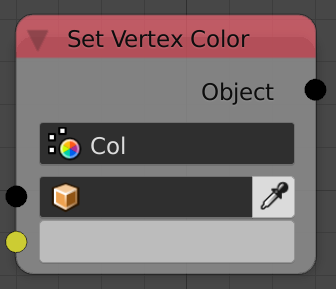
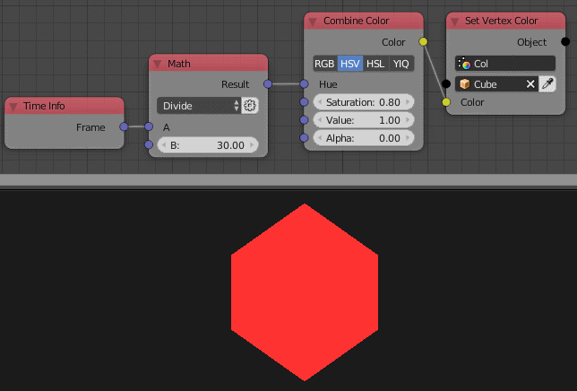

Set Vertex Color
================

Description
-----------

This node creates a vertex color layer and fills it with a single color.

Inputs
------

- **Object** - The object that will carry the vertex color layer.
- **Color** - The color of each vertex of the object.

Outputs
-------

- **Object** - The input object.

Advanced Node Settings
----------------------

- **Check Color** - If this is enabled, Animation Nodes will check if the color has changed before setting the new color. If it hasn't, Animation Nodes will return the object without any change. This will result in a speed up in the execution time if you are not changing the color. So make sure to check it if you want to speed up the execution.

Note
----

If the name you entered in the vertex color layer is the name of an existing vertex color layer, Animation nodes will overwrite the data of this layer instead of creating a new one.

Examples of Usage
-----------------

