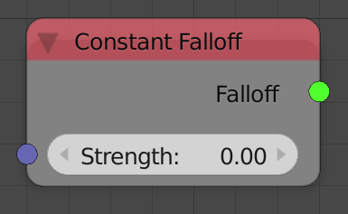
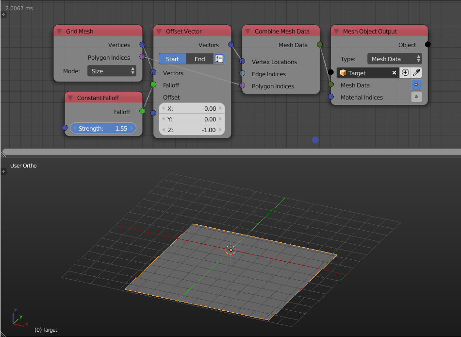

Constant Falloff
================

Description
-----------

This node creates a falloff that associate a constant float for every object.

Inputs
------

- **Strength** - A float to associate to every object.

Outputs
-------

- **Falloff** - The actual falloff object.

Advanced Node Settings
----------------------

- N/A

Examples of Usage
-----------------

