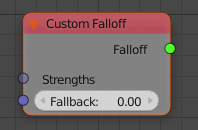
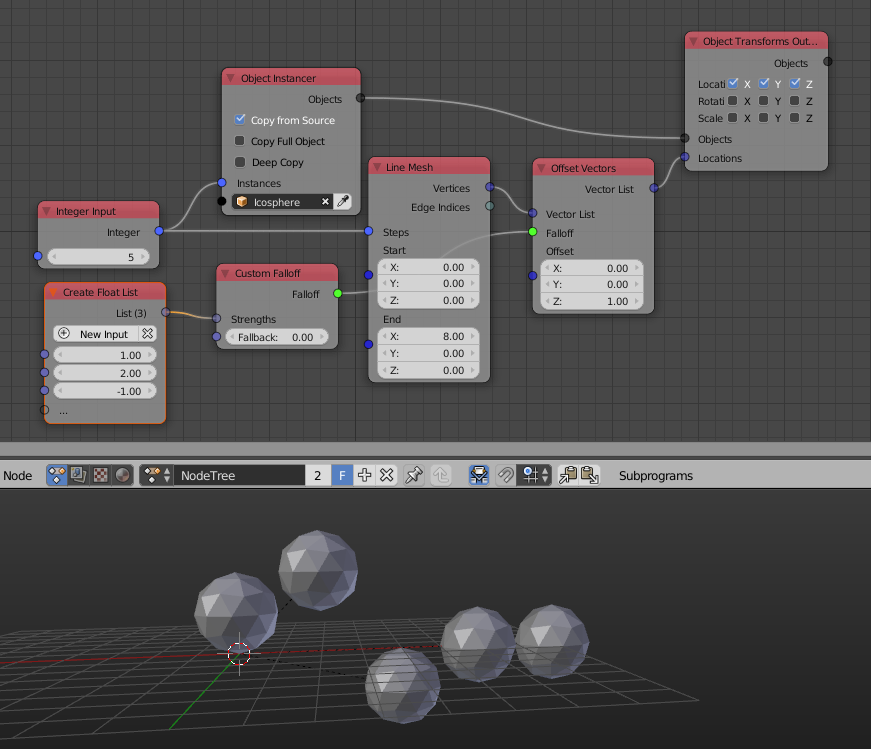

Custom Falloff
==============

A falloff essentially is a function that calculates the strength of an effect for each object in a list. This node allows you "precompute" exactly these strengths.

Inputs
------

- **Strengths** - List of the precomputed strengths.
- **Fallback** (hidden by default) - Used when the falloff is evaluated for a list that is longer than the list in the *Strengths* input.

Outputs
-------

- **Falloff** - The actual falloff object.

Advanced Node Settings
----------------------

- N/A

Examples of Usage
-----------------

