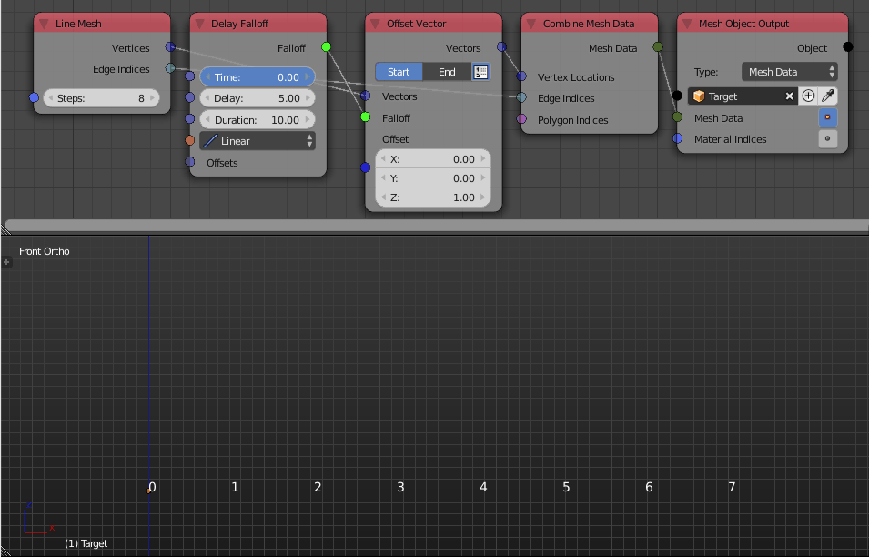

Delay Falloff
=============

Description
-----------

This node creates an index based falloff that associates a float that increases as the time increases where objects at indicies that are closer to zero starts increasing before those that are farther away from zero. User can control the rate of increasing relative to time and indices.

.. image:: images/delay_falloff_node.png
   :width: 160pt

Illustration
------------

The vertices of the line are suppose to move one unit in the z-axis but since I used the **Delay Falloff** as a factor, the offset depend on time. We notice, as the time increase, the vertex at first index start moving, the vertex at the second index didn't start moving till the time became ``5`` which is the **Delay** input, the vertex at the first index stopped moving when time reached ``10`` which is the **Duration** input. So we conclude that input **Delay** is the time it takes for an object to start moving relative to the previous object while the input **Duration** is the amount of time it takes for every object to reach its maximum value which is ``1``. The output is also evaluated at the input interpolation.

Inputs
------

- **Time** - The current time.
- **Delay** - Time span between the animation start of two successive objects.
- **Duration** - Time it takes for an object to reach its maximum value (1).
- **Interpolation** - The output is evaluated at this input interpolation or the velocity function of the animation.
- **Offsets** - When given, it specifies how much each object is offset in time.

Outputs
-------

- **Falloff** - The actual falloff object.

Advanced Node Settings
----------------------

- N/A

Examples of Usage
-----------------

