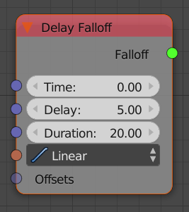

Delay Falloff
=============

This node is very practical if you want to apply an effect an many objects with an offset in time.

Inputs
------

- **Time** - Current time. Often this is just the current frame.
- **Delay** - Default time span between the animation start of two objects.
- **Duration** - How long the animation will last.
- **Interpolation** - How fast the influence will change at each point in time.
- **Offsets** - Optional. When given it specifies how much each object is offsetted in time.

Outputs
-------

- **Falloff** - The actual falloff object.

Advanced Node Settings
----------------------

- N/A

Examples of Usage
-----------------

Fly in each letter of a text:

    .. image:: images/text_animation_example.png

Scale objects in a group based on selection order:

    .. image:: images/selection_index_example.png
