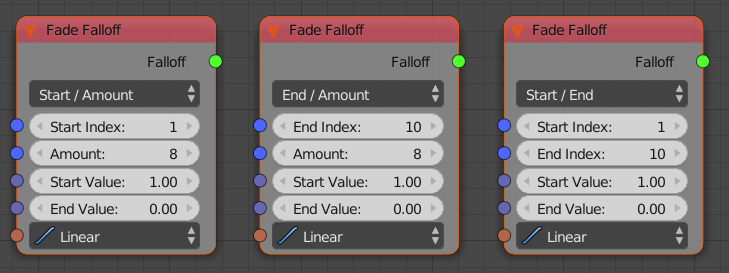
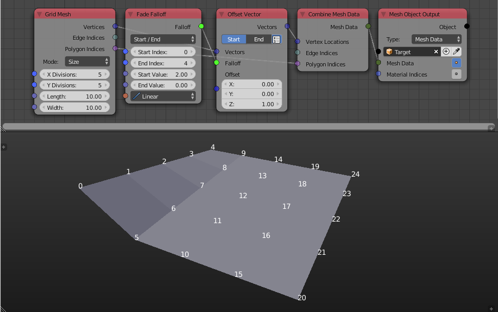
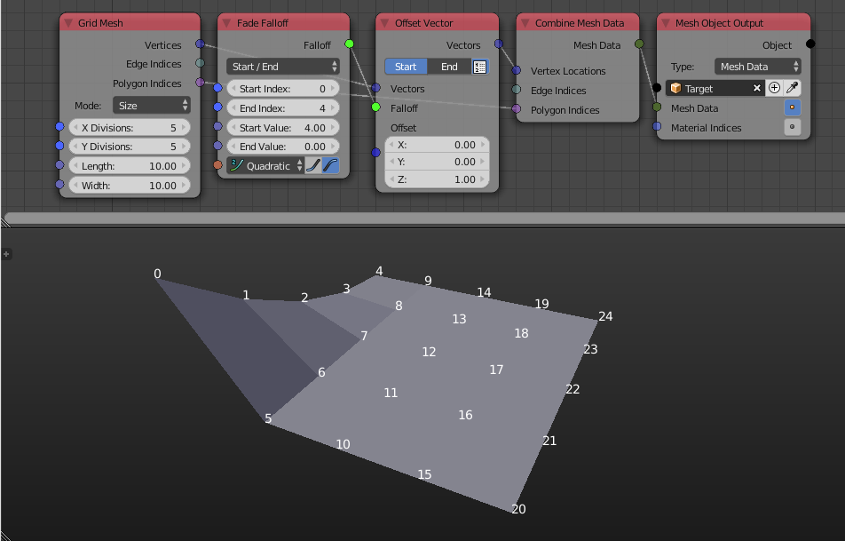
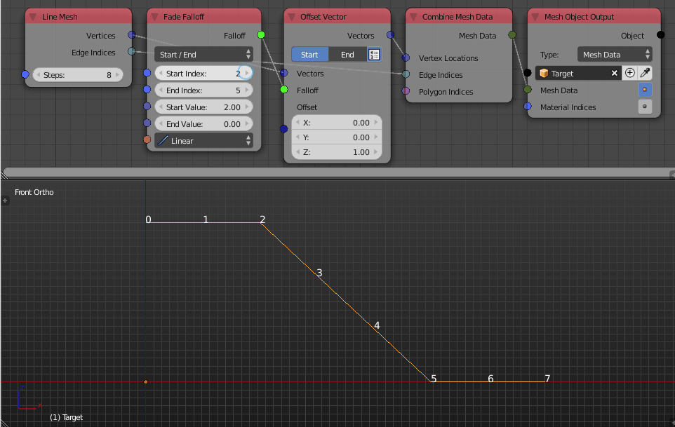

Fade Falloff
============

Description
-----------

This node creates an index based falloff that associates input **Start Value** to all objects with index less than some input index and the input **End Value** to all objects with index more than some input index, while the objects at indicies in between are associated with values in between the **Start Value** and **End Value** evaluated at the input interpolation.

Illustration
------------

The examples above shows the fade falloff node in action. We offset the vertices of the grid by one unit in the z-axis and used the **Fade Falloff** node as a factor for that offset. The **Start Index** is set to ``0`` so all vertices with index less than ``0`` are offset ``2`` units in the z-axis because the original offset multiplied by the **Start Value** is ``1x2=2``. The **End Index** is set to ``4`` so all vertices with index larger than ``4`` are not offset because the original offset multiplied by the **End Value** is ``1x0=0``. Indices in between however (from ``0`` to ``4``) are offset with amounts linearly changing between ``0`` and ``2``. Had I used a non-linear interpolation, values will no longer linearly change as in the following example:

Notice how they are changing exponentially and how the start value affected the offset.

Options
-------

Options are only different on how the start and end index are defined.

- **Start / End** - User define start and end indices directly.
- **Start / Amount** - User define start index and the amount of indices in the interval.
- **End / Amount** - Use define the end index and the amount of indices in the interval.

Inputs
------

- **Start value** - The value the fading start with.
- **End Value** - The value the fading end with.
- **Interpolation** - An interpolation that output is evaluated at.

Outputs
-------

- **Falloff** - The actual falloff object.

Advanced Node Settings
----------------------

- N/A

Examples of Usage
-----------------

