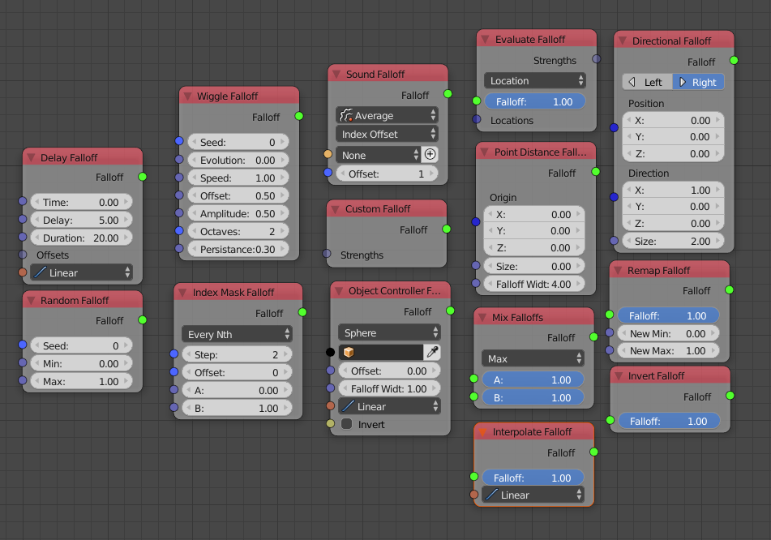

Falloff
=======

.. toctree::
   :titlesonly:

   Constant Falloff <constant_falloff>
   Delay Falloff <delay_falloff>
   Random Falloff <random_falloff>
   Index Mask Falloff <index_mask_falloff>

Abstractly speaking a falloff is a function that calculates the influence of an effect for a specific object. Often zero means *no effect* and one means *100%*. However, values not within this range are possible in many cases.

Everything that can be done using falloffs can be done without them as well but using them has many benefits:

    1. The **performance** is much better.
    2. **Less nodes** are required to archieve many effects.
    3. They provide a more "declarative" approach to express animations which in return makes falloffs much more **artists friendly**.

The easiest falloff is the **Constant Falloff** which will tell an effect to influence every object in a list with equal strength. A constant falloff will be created automatically if a falloff input is not connected to anything else.

The following examples creates 6 copies of the cube which all have a z-location of 1.5 because the Offset Matices node moves everything up by 3 but the falloff says that the influence of the node should be 50% for all objects.

    .. image:: images/constant_falloff_example.png

Another often used falloff is the **Object Controller Falloff** which makes it easy to control the strength of an effect by moving an object in the 3D view.

While falloffs are much more high level than many other nodes they still give you a lot of control. E.g. it is possible to mix falloffs together with the **Mix Falloffs** node. If you need even more control there also is a **Custom Falloff** node that takes a Float List as input that tells how much each object should be influenced.

