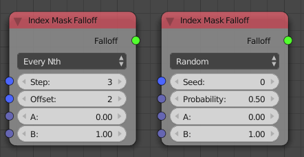
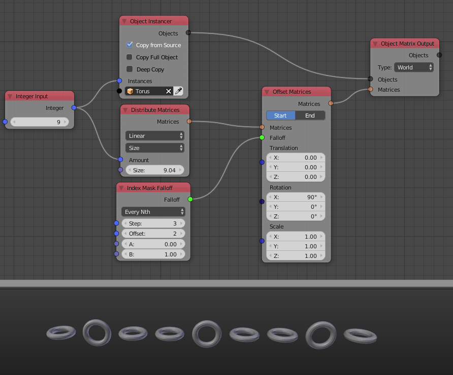

Index Mask Falloff
==================

Can be used to influence specific objects only based on their index (position in list).

This node two modes currently:

    - **Every Nth**: Only influence every second or third or whatever element.
    - **Random**: Only influence some randomly choosen elements.

Inputs
------

Depending on the mode this node has different sets of inputs. In both bases there are two influences called **A** and **B**:

- **A** - Tells how much an object should be influenced that is *not* selected.
- **B** - Tells how much an object should be influenced that is selected.

In **Every Nth** mode there are two more inputs:

    - **Step** - If there is a 4, every forth element is "selected".
    - **Offset** - E.g. to specify wether all even or odd elements should be "selected".

In **Random** mode there are two more inputs as well:

    - **Seed** - Change to get a different set of selected elements.
    - **Probability** - How likely it is that a random element is choosen (0.5 means that ca half of the elements are selected)

Outputs
-------

- **Falloff** - The actual falloff object.

Advanced Node Settings
----------------------

- N/A

Examples of Usage
-----------------

