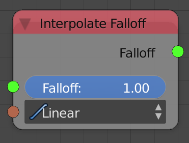
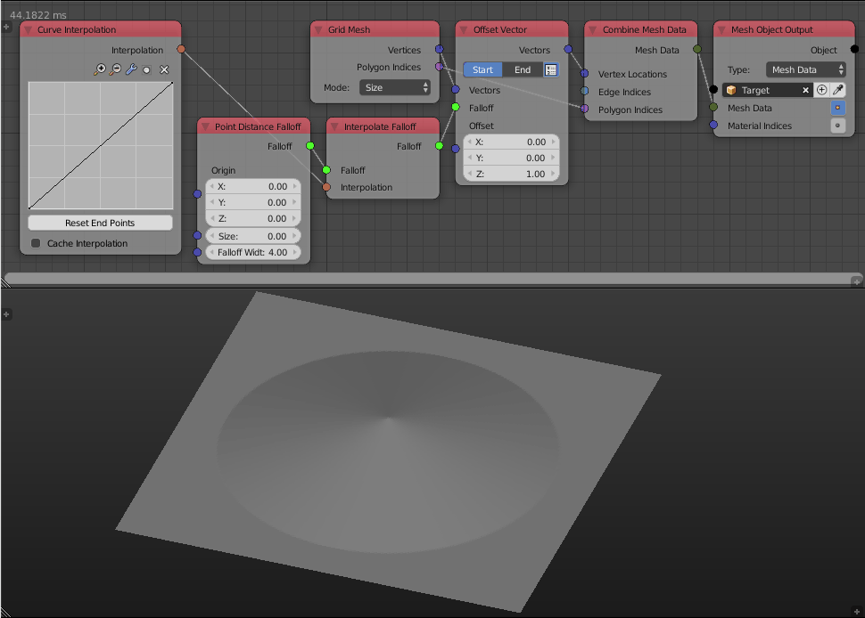

Interpolate Falloff
===================

Description
-----------

This node evaluates the floats of the input falloff at the input interpolation.

Inputs
------

- **Falloff** - A falloff
- **Interpolation** - An interpolation to evaluate the falloff at.

Outputs
-------

- **Falloff** - The actual falloff object.

Advanced Node Settings
----------------------

- N/A

Examples of Usage
-----------------

