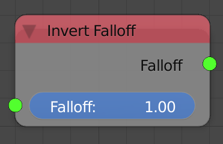
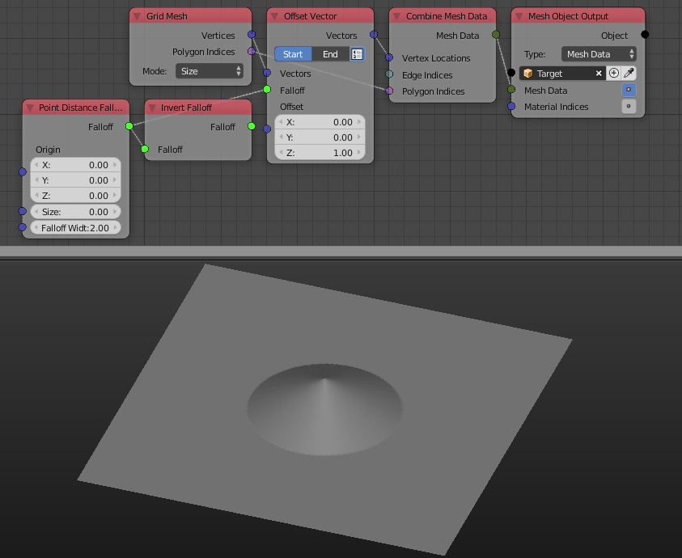

Invert Falloff
==============

Description
-----------

This node invert the input falloff. If its floats were ``x`` then the output will be ``1-x`` clamped to the ``[0,1]`` range of course.

Inputs
------

- **Falloff** - A falloff.

Outputs
-------

- **Falloff** - The actual falloff object.

Advanced Node Settings
----------------------

- N/A

Examples of Usage
-----------------

