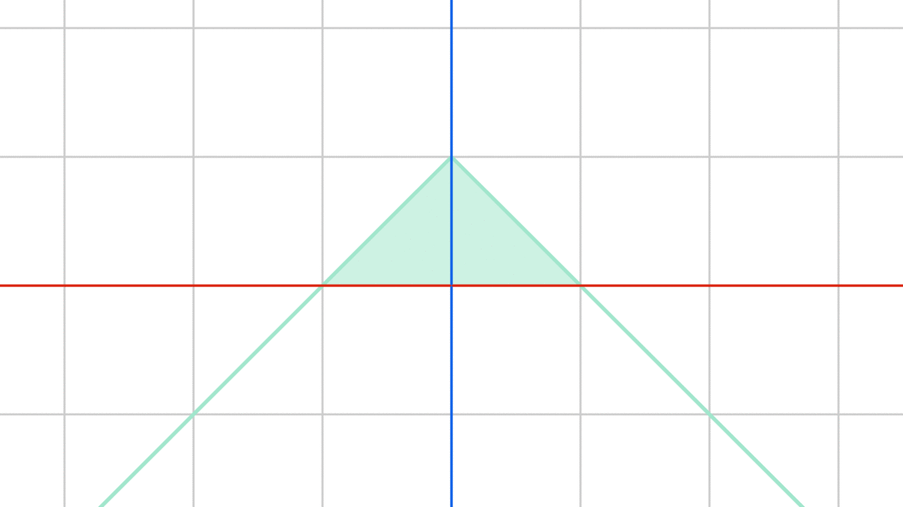

Object Controller Falloff
=========================

Description
-----------

This node creates a vector based falloff that associates to every object a float that is equal to inverse the distance from it to some controller object, that distance can be 3D or 1D.

.. image:: images/object_controller_falloff_node.png
   :width: 160pt

Options
-------

- **Sphere** - This option associates to every object a float that is equal to inverse the distance from it to some controller object. This float is always in ``[0,1]`` range, So some distances will be clamped to ``1`` or ``0``. We conclude that objects that are closer to the controller will have a large float that doesn't exceed ``1`` and as objects gets away, their floats starts to fade till it becomes zero at some point. This float is added to the scale of the controller object, so scaling the controller object will result in increase in the floats of every object.

.. image:: gifs/object_controller_falloff_node_example.gif

Illustration
^^^^^^^^^^^^

In this illustration, I set the z-position of the points of a line to their falloff floats which formed some kind of triangle. As we said, the float is equal to inverse the distance from the point to the position of the input object which I placed at ``(0,0,0)`` in this illustration. Let the distance be ``D``, then inverse of the distance is ``1-D``. So point ``(0,0,0)`` will have a ``D`` of ``0`` (because distance between ``(0,0,0)`` and ``(0,0,0)`` is zero) and a ``1-D=1-0=1``, that's why the point in the middle have a z-location of ``1``. Point ``(1,0,0)`` on the other hand have a ``D`` of ``1`` and a ``1-D=1-1=0`` , that's why the point at ``(1,0,0)`` has a z-location of zero. Points further away will have a negative inverse distances and thus negative z-locations. But as we said, values are clamped to ``[0,1]`` range and so negative floats will be zeroes and floats larger than one will be equal ones (We currently don't have values larger than one).

What I am going to do is add some value to the floats which result in inverse distances larger than one which will then be clamped to one, since the inverse distance is the z-location of the points, adding a value to the float will result in moving the triangle in the z-direction. The illustration shows what happens when this value is added when clamping is present.

Furthermore, multiplying the floats by some value will change the rate of changing of the floats and thus have a wider based triangle, which is shown in the illustration as scaling the triangle which is what multiplication graphically denote.

In the node inputs, input **Offset** is the value that gets added while input **Width** is the value that gets multiplied.

Shaded area is the actual points position after clamping, outline is the values before clamping. Notice how outline exceed one and deceed zero:

- **Directional** - This option associates to every object a float that is equal to inverse the distance from it to some controller object along a single axis. The chosen axis will be the local axis of the controller object, so rotating the object changes the direction. This float is always in ``[0,1]`` range, So some distances will be clamped to ``1`` or ``0``. We conclude that objects that are closer to the controller along some axis will have a large float that doesn't exceed ``1`` and as object gets away, their floats starts to fade till it becomes zero at some point. This float is multiplied by the scale of the controller object, so scaling the controller object will result in increase in the floats of every object.

Use the same reasoning as the sphere option to understand this better.

.. image:: gifs/object_controller_falloff_node_example2.gif

Inputs
------

- **Controller** - An object to use as the controller. You probably want to use empties because actual objects won't make a difference, all the node needs is their location, rotation and scale.
- **Offset** - This float will be added to the floats of all object resulting in an offset just as if you scaled the controller. (Only in **Sphere** option)
- **Falloff Width** - This float defines the distance between the ones and zeros, so a higher value will result in smoother result with lower slope. (Only in **Sphere** option)
- **Interpolation** - Floats will be evaluated at this interpolation.
- **Invert** - If true, the floats will be inverted, so zeroes will be ones and ones will be zeroes.

Outputs
-------

- **Falloff** - The actual falloff object.

Advanced Node Settings
----------------------

- N/A

Examples of Usage
-----------------

.. image:: gifs/object_controller_falloff_node_example.gif
