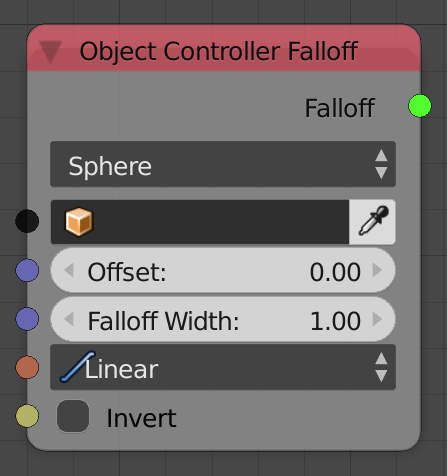
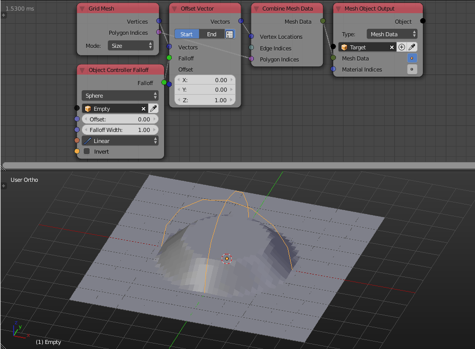
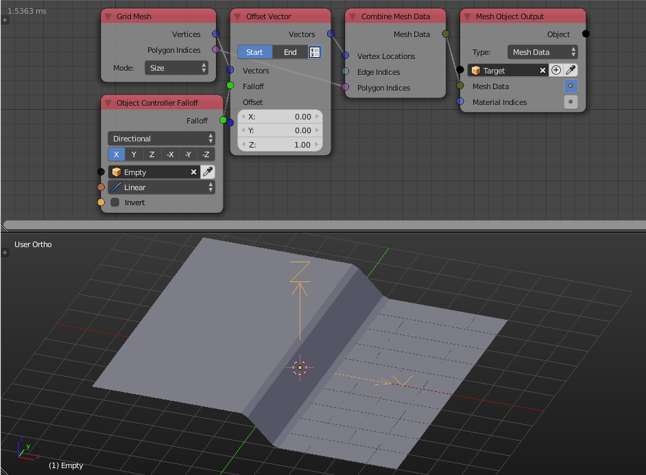

Object Controller Falloff
=========================

Description
-----------

This node creates a vector based falloff that associates to every object a float that is equal to inverse the distance from it to some controller object, that distance can be 3D or 1D.

Options
-------

- **Sphere** - This option associates to every object a float that is equal to inverse the distance from it to some controller object. This float is always in ``[0,1]`` range, So some distances will be clamped to ``1`` or ``0``. We conclude that objects that are closer to the controller will have a large float that doesn't exceed ``1`` and as object gets away, their floats starts to fade till it becomes zero at some point. This float is multiplied by the scale of the controller object, so scaling the controller object will result in increase in the floats of every object.

- **Directional** - This option associates to every object a float that is equal to inverse the distance along a single axis from it to some controller object. The chosen axis will be the local axis of the controller object, so rotating the object changes the direction. This float is always in ``[0,1]`` range, So some distances will be clamped to ``1`` or ``0``. We conclude that objects that are closer to the controller along some axis will have a large float that doesn't exceed ``1`` and as object gets away, their floats starts to fade till it becomes zero at some point. This float is multiplied by the scale of the controller object, so scaling the controller object will result in increase in the floats of every object.

Inputs
------

- **Controller** - An object to use as the controller. You probably want to use empties because actual objects won't make a difference, all the node needs is their location, rotation and scale.
- **Offset** - This float will be added to the floats of all object resulting in an offset just as if you scaled the controller. (Only in **Sphere** option)
- **Falloff With** - This float defines the distance between the ones and zeros, so a higher value will result in smoother result with lower slope. (Only in **Sphere** option)
- **Interpolation** - Floats will be evaluated at this interpolation.
- **Invert** - If true, the floats will be inverted, so zeroes will be ones and ones will be zeroes.

Outputs
-------

- **Falloff** - The actual falloff object.

Advanced Node Settings
----------------------

- N/A

Examples of Usage
-----------------

