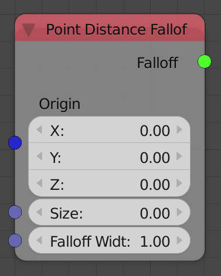
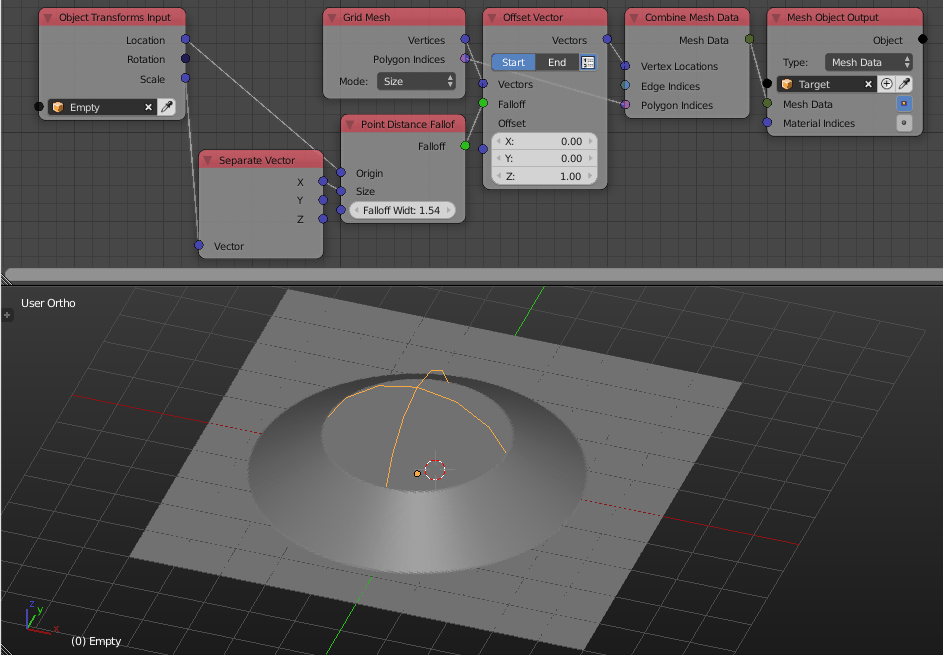

Point Distance Falloff
======================

Description
-----------

This node creates a vector based falloff that associates to every object a float that is equal to inverse the distance to some point. This float is always in ``[0,1]`` range, So some distances will be clamped to ``1`` or ``0``. We conclude that objects that are closer to the input point will have a large float that doesn't exceed ``1`` and as objects gets away, their floats starts to fade till it becomes zero at some point.

Inputs
------

- **Origin** - The position of the point.
- **Size** - This float is added to the floats of every object. It acts as an offset for the distances.
- **Falloff Width** - A float that is multiplied by the floats, can be though of as the slope of decreasing.

Outputs
-------

- **Falloff** - The actual falloff object.

Advanced Node Settings
----------------------

- N/A

Examples of Usage
-----------------

