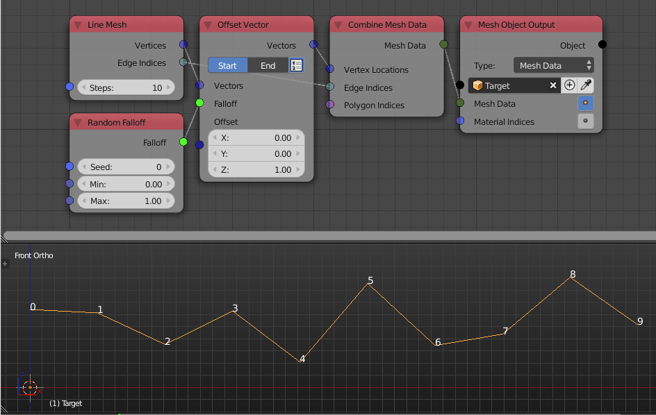

Random Falloff
==============

Description
-----------

This node creates an index based falloff that associates a random float for every object.

.. image:: images/random_falloff_node.png
   :width: 160pt

Inputs
------

- **Seed** - Change this to get a different set of random numbers.
- **Min** - Lower bound for the random numbers, can't be less than zero.
- **Max** - Upper bound for the random numbers, can't be larger than one.

Outputs
-------

- **Falloff** - The actual falloff object.

Advanced Node Settings
----------------------

- N/A

Examples of Usage
-----------------

